```{r setup, include=FALSE}
knitr::opts_chunk$set(echo = TRUE, warning = FALSE, message = FALSE, fig.width = 10, fig.height = 6)
```

## 1. Introduction

Passenger satisfaction is a key competitive indicator for airlines, yet difficult to measure due to multiple interacting factors. We structure our analysis around five research questions examining how demographics, travel context, and service attributes jointly impact satisfaction.

## 2. Dataset Overview

This study uses the Airline Passenger Satisfaction dataset from Kaggle, containing 103,904 training and 25,976 test records with 25 variables including demographics, 14 service ratings (0–5 scale), and binary satisfaction outcomes.

```{r data-prep, include=FALSE, message=FALSE, warning=FALSE}
library(tidyverse)
library(broom)

read_one <- function(path, tag) {
  readr::read_csv(path, show_col_types = FALSE) |>
    dplyr::mutate(.dataset = tag)
}

train_df <- read_one("dataset/train.csv", "train")
test_df  <- read_one("dataset/test.csv",  "test")
raw_df   <- dplyr::bind_rows(train_df, test_df)

service_columns <- c(
  "Inflight wifi service",
  "Departure/Arrival time convenient",
  "Ease of Online booking",
  "Gate location",
  "Food and drink",
  "Online boarding",
  "Seat comfort",
  "Inflight entertainment",
  "On-board service",
  "Leg room service",
  "Baggage handling",
  "Checkin service",
  "Inflight service",
  "Cleanliness"
)
service_columns <- intersect(service_columns, colnames(raw_df))

age_breaks <- c(-Inf, 17, 25, 35, 45, 55, 65, Inf)
age_labels <- c("<18", "18-25", "26-35", "36-45", "46-55", "56-65", "66+")

df <- raw_df |>
  dplyr::filter(!is.na(Age)) |>
  dplyr::mutate(
    age_group = cut(Age, breaks = age_breaks, labels = age_labels, right = TRUE, ordered_result = TRUE)
  ) |>
  dplyr::mutate(dplyr::across(dplyr::all_of(service_columns), as.numeric))

long_scores <- df |>
  tidyr::pivot_longer(
    cols = dplyr::all_of(service_columns),
    names_to = "service",
    values_to = "score"
  ) |>
  dplyr::mutate(score = dplyr::na_if(score, 0))

summary_scores <- long_scores |>
  dplyr::group_by(age_group, service) |>
  dplyr::summarise(
    mean_score = mean(score, na.rm = TRUE),
    n_rated = sum(!is.na(score)),
    .groups = "drop"
  )

topk <- 5
top5_by_age <- summary_scores |>
  dplyr::group_by(age_group) |>
  dplyr::arrange(dplyr::desc(mean_score), .by_group = TRUE) |>
  dplyr::slice_head(n = topk) |>
  dplyr::ungroup() |>
  dplyr::mutate(service = forcats::fct_reorder(service, mean_score))

available_age_groups <- unique(na.omit(df$age_group))
available_age_groups <- available_age_groups[order(available_age_groups)]
ks_pair <- as.character(c(head(available_age_groups, 1), tail(available_age_groups, 1)))

ks_results <- NULL
if (length(ks_pair) == 2) {
  ks_results <- purrr::map_dfr(service_columns, function(sv) {
    sub_data <- long_scores |>
      dplyr::filter(service == sv, !is.na(age_group), !is.na(score), age_group %in% ks_pair)
    g1 <- sub_data |>
      dplyr::filter(age_group == ks_pair[1]) |>
      dplyr::pull(score)
    g2 <- sub_data |>
      dplyr::filter(age_group == ks_pair[2]) |>
      dplyr::pull(score)
    if (length(g1) >= 10 && length(g2) >= 10) {
      ks <- suppressWarnings(stats::ks.test(g1, g2))
      tibble::tibble(
        service = sv,
        group_a = ks_pair[1],
        group_b = ks_pair[2],
        statistic = unname(ks$statistic),
        p_value = ks$p.value
      )
    } else {
      tibble::tibble(
        service = sv,
        group_a = ks_pair[1],
        group_b = ks_pair[2],
        statistic = NA_real_,
        p_value = NA_real_
      )
    }
  })
}

logit_df <- df |>
  dplyr::mutate(
    satisfaction_binary = dplyr::case_when(
      !is.na(satisfaction) & satisfaction == "satisfied" ~ 1L,
      !is.na(satisfaction) ~ 0L,
      TRUE ~ NA_integer_
    )
  ) |>
  dplyr::mutate(dplyr::across(dplyr::all_of(service_columns), ~ dplyr::na_if(.x, 0))) |>
  dplyr::select(satisfaction_binary, age_group, dplyr::all_of(service_columns)) |>
  tidyr::drop_na()

logit_top_terms <- NULL
if (nrow(logit_df) > 100) {
  rhs <- paste(c("age_group", paste0("`", service_columns, "`")), collapse = " + ")
  fml <- stats::as.formula(paste0("satisfaction_binary ~ ", rhs))
  logit_fit <- stats::glm(fml, data = logit_df, family = stats::binomial())
  logit_tidy <- broom::tidy(logit_fit, conf.int = TRUE, exponentiate = TRUE) |>
    dplyr::mutate(
      term_clean = stringr::str_replace_all(term, "`", ""),
      is_age = stringr::str_starts(term_clean, "age_group")
    ) |>
    dplyr::filter(term != "(Intercept)")
  logit_top_terms <- logit_tidy |>
    dplyr::arrange(p.value) |>
    dplyr::slice_head(n = 20) |>
    dplyr::mutate(term_clean = forcats::fct_reorder(term_clean, estimate))
}

# Q4: Cabin Class × Flight Distance Analysis
cabin_col <- dplyr::coalesce(
  if ("Class" %in% colnames(raw_df)) "Class" else NULL,
  if ("Cabin.Class" %in% colnames(raw_df)) "Cabin.Class" else NULL,
  grep("class|Class", colnames(raw_df), ignore.case = TRUE, value = TRUE)[1]
)

distance_var <- dplyr::case_when(
  "Flight.Distance" %in% colnames(raw_df) ~ "Flight.Distance",
  "Flight Distance" %in% colnames(raw_df) ~ "Flight Distance",
  TRUE ~ NA_character_
)

df_q4 <- raw_df |>
  dplyr::filter(!is.na(.data[[cabin_col]])) |>
  dplyr::mutate(
    satisfaction_binary_q4 = dplyr::case_when(
      !is.na(satisfaction) & satisfaction == "satisfied" ~ 1L,
      !is.na(satisfaction) ~ 0L,
      TRUE ~ NA_integer_
    )
  )

if (!is.na(distance_var)) {
  df_q4 <- df_q4 |>
    dplyr::filter(!is.na(.data[[distance_var]])) |>
    dplyr::mutate(
      distance_category = cut(
        .data[[distance_var]],
        breaks = c(0, 1000, 3000, Inf),
        labels = c("Short-haul (<1000km)", "Medium-haul (1000-3000km)", "Long-haul (>3000km)"),
        include.lowest = TRUE
      ),
      cabin_distance = interaction(.data[[cabin_col]], distance_category, sep = " × ", drop = TRUE),
      cabin_factor = as.factor(.data[[cabin_col]]),
      distance_factor = as.factor(distance_category)
    ) |>
    dplyr::mutate(dplyr::across(dplyr::all_of(service_columns), ~ dplyr::na_if(as.numeric(.x), 0)))
}

# Q4 Heatmap data
heatmap_q4 <- NULL
if (exists("df_q4") && "cabin_distance" %in% colnames(df_q4)) {
  heatmap_q4 <- df_q4 |>
    tidyr::pivot_longer(
      cols = dplyr::all_of(service_columns),
      names_to = "service",
      values_to = "score"
    ) |>
    dplyr::group_by(cabin_distance, service) |>
    dplyr::summarise(
      mean_score = mean(score, na.rm = TRUE),
      .groups = "drop"
    )
}

# Q4 Top-5 by cabin_distance
top5_q4 <- NULL
if (!is.null(heatmap_q4)) {
  top5_q4 <- heatmap_q4 |>
    dplyr::group_by(cabin_distance) |>
    dplyr::arrange(dplyr::desc(mean_score), .by_group = TRUE) |>
    dplyr::slice_head(n = 5) |>
    dplyr::ungroup()
}

# Q4 K-S Test: Compare Eco Plus Short-haul vs Long-haul
ks_results_q4 <- NULL
if (exists("df_q4") && "cabin_distance" %in% colnames(df_q4)) {
  cabin_distance_levels <- unique(na.omit(df_q4$cabin_distance))
  eco_plus_levels <- cabin_distance_levels[grepl("Eco Plus", as.character(cabin_distance_levels))]
  
  if (length(eco_plus_levels) >= 2) {
    group1_q4 <- eco_plus_levels[grepl("Short", as.character(eco_plus_levels))][1]
    group2_q4 <- eco_plus_levels[grepl("Long", as.character(eco_plus_levels))][1]
    
    if (!is.na(group1_q4) && !is.na(group2_q4)) {
      ks_results_q4 <- purrr::map_dfr(service_columns, function(sv) {
        sub_data <- df_q4 |>
          dplyr::filter(cabin_distance %in% c(group1_q4, group2_q4), !is.na(.data[[sv]]))
        g1 <- sub_data |>
          dplyr::filter(cabin_distance == group1_q4) |>
          dplyr::pull(sv)
        g2 <- sub_data |>
          dplyr::filter(cabin_distance == group2_q4) |>
          dplyr::pull(sv)
        if (length(g1) >= 10 && length(g2) >= 10) {
          ks <- suppressWarnings(stats::ks.test(g1, g2))
          tibble::tibble(
            service = sv,
            group_a = as.character(group1_q4),
            group_b = as.character(group2_q4),
            statistic = unname(ks$statistic),
            p_value = ks$p.value
          )
        } else {
          tibble::tibble(
            service = sv,
            group_a = as.character(group1_q4),
            group_b = as.character(group2_q4),
            statistic = NA_real_,
            p_value = NA_real_
          )
        }
      })
    }
  }
}

# Q4 ANOVA: Interaction effects
anova_results_q4 <- NULL
if (exists("df_q4") && "cabin_factor" %in% colnames(df_q4) && "distance_factor" %in% colnames(df_q4)) {
  anova_results_q4 <- purrr::map_dfr(service_columns, function(sv) {
    model <- stats::aov(df_q4[[sv]] ~ df_q4$cabin_factor * df_q4$distance_factor, data = df_q4)
    smry <- summary(model)[[1]]
    tibble::tibble(
      service = sv,
      Cabin_F = smry$`F value`[1],
      Distance_F = smry$`F value`[2],
      Interaction_F = smry$`F value`[3],
      Cabin_p = smry$`Pr(>F)`[1],
      Distance_p = smry$`Pr(>F)`[2],
      Interaction_p = smry$`Pr(>F)`[3]
    )
  }) |>
    dplyr::arrange(Interaction_p)
}
```

## 3. Research Question Analysis

### 3.1 What is the relationship between passengers' overall satisfaction and their age as well as service demands?

This question examines how service priorities shift across age groups to help airlines tailor offerings for different demographics.

```{r fig-heatmap, echo=FALSE, fig.cap="Figure 3.1 Average service ratings by age group", fig.pos='H', out.width="75%"}
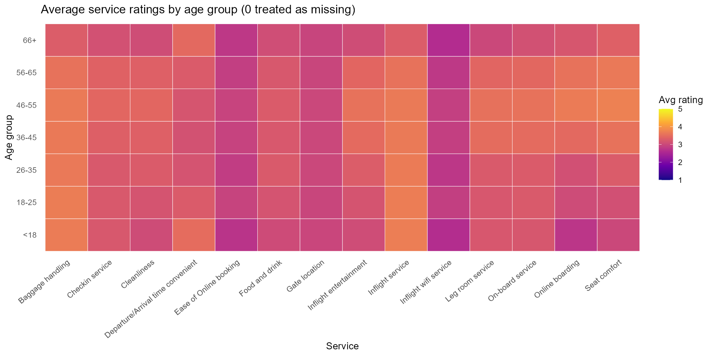
```

The heatmap shows Inflight service, Baggage handling, and Seat comfort receive high ratings across age groups, while younger passengers rate digital services lower.

```{r fig-top5, echo=FALSE, fig.cap="Figure 3.2 Top-5 services by age group", fig.pos='H', out.width="80%"}
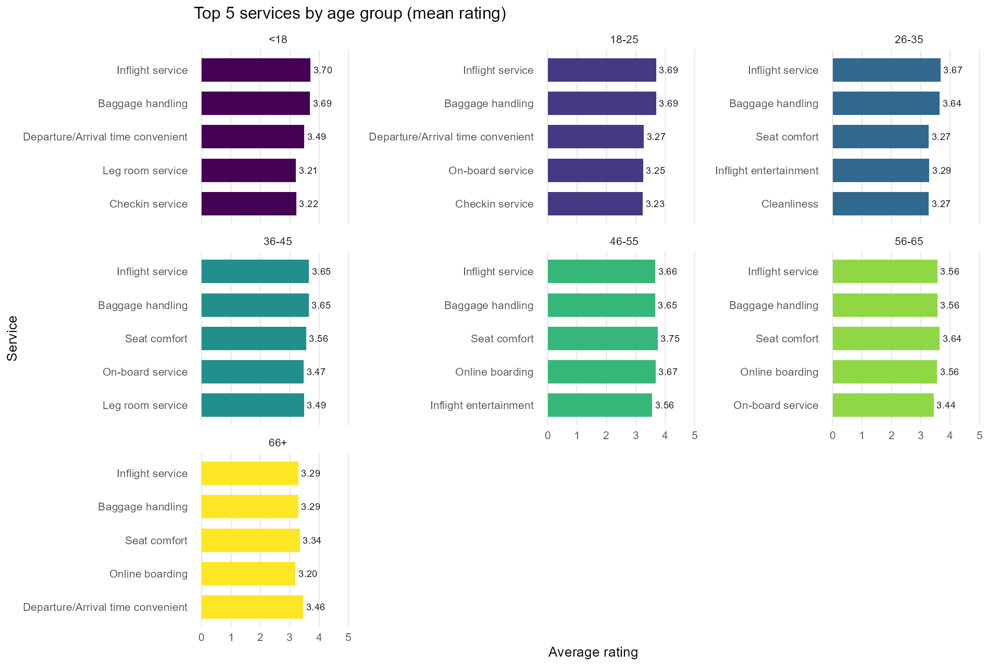
```

Younger groups (18–35) prioritize technology-enabled services, while older passengers (66+) emphasize physical comfort and travel support.

```{r fig-ks, echo=FALSE, fig.cap="Figure 3.3 K–S test results", fig.pos='H', out.width="65%"}
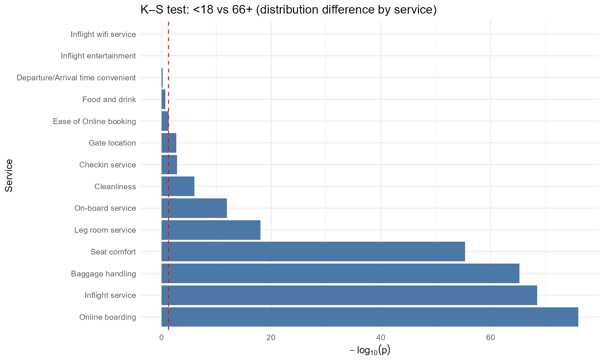
```

Kolmogorov–Smirnov tests show significant differences (p < 0.001) for online boarding, Inflight service, Baggage handling, and Seat comfort between youngest and oldest groups.

```{r fig-logit, echo=FALSE, fig.cap="Figure 3.4 Logistic regression", fig.pos='H', out.width="70%"}
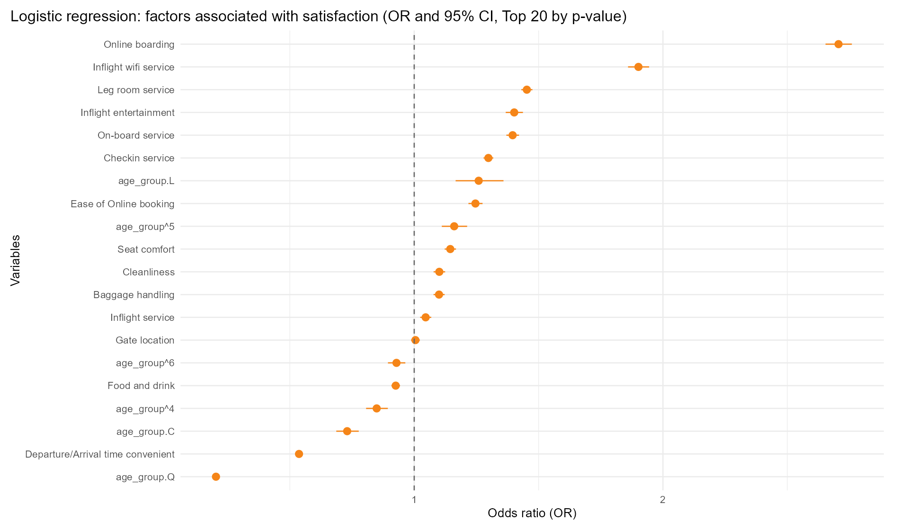
```

Logistic regression identifies online boarding, inflight wifi, leg room service, and inflight entertainment as key satisfaction predictors, with age-related polynomial terms indicating nonlinear demographic effects.

In summary, age moderates service experience: younger passengers value digital touchpoints, while older passengers prioritize comfort. Airlines should enhance digital services for younger travelers and improve physical comfort for older passengers.

### 3.2 Do passengers place higher ratings or importance on "entertainment" and "catering" for longer flights?

We investigate whether passengers assign higher ratings to entertainment and catering on longer flights using multiple linear regression, controlling for demographics and other service dimensions.

```{r rq2-data-load, include=FALSE, message=FALSE, warning=FALSE}
## Load model results
if (file.exists("output/yiming44/models/key_results_flight_distance.csv")) {
  key_results <- readr::read_csv("output/yiming44/models/key_results_flight_distance.csv", show_col_types = FALSE)
  fit_stats <- readr::read_csv("output/yiming44/models/model_fit_statistics.csv", show_col_types = FALSE)
  desc_stats <- readr::read_csv("output/yiming44/models/descriptive_statistics.csv", show_col_types = FALSE)
  
  ## Extract key coefficients
  ent_coef <- key_results$Coefficient[key_results$Model == "Entertainment_Full"]
  ent_pval <- key_results$P_value[key_results$Model == "Entertainment_Full"]
  cat_coef <- key_results$Coefficient[key_results$Model == "Catering_Full"]
  cat_pval <- key_results$P_value[key_results$Model == "Catering_Full"]
  
  ## Extract R-squared values
  ent_r2 <- fit_stats$Adj_R_squared[fit_stats$Model == "Entertainment_Full"]
  cat_r2 <- fit_stats$Adj_R_squared[fit_stats$Model == "Catering_Full"]
} else {
  ## Default values if files don't exist yet
  ent_coef <- -0.000005
  ent_pval <- 0.083
  cat_coef <- -0.000015
  cat_pval <- 0.000025
  ent_r2 <- 0.629
  cat_r2 <- 0.467
}
```

```{r fig-rq2-scatter, echo=FALSE, fig.cap="Figure 3.2.2 Entertainment and catering ratings vs flight distance", fig.pos='H', out.width="85%"}
if (file.exists("output/yiming44/figures/02_entertainment_vs_distance.png") && 
    file.exists("output/yiming44/figures/03_catering_vs_distance.png")) {
  if (!requireNamespace("gridExtra", quietly = TRUE)) {
    install.packages("gridExtra", repos = "https://cran.rstudio.com/")
  }
  library(gridExtra)
  library(png)
  p1 <- grid::rasterGrob(readPNG("output/yiming44/figures/02_entertainment_vs_distance.png"), interpolate = TRUE)
  p2 <- grid::rasterGrob(readPNG("output/yiming44/figures/03_catering_vs_distance.png"), interpolate = TRUE)
  grid.arrange(p1, p2, ncol = 2)
} else {
  cat("Figures not yet generated. Please run the analysis script.")
}
```

\FloatBarrier

Figure 3.2.2 displays scatter plots with fitted regression lines. The red dashed line shows the linear trend with 95% confidence intervals; steeper lines indicate stronger positive associations.

```{r fig-rq2-coef, echo=FALSE, fig.cap="Figure 3.2.3 Effect of flight distance on service ratings (with 95% confidence intervals)", fig.pos='H', out.width="65%"}
if (file.exists("output/yiming44/figures/04_coefficient_comparison.png")) {
  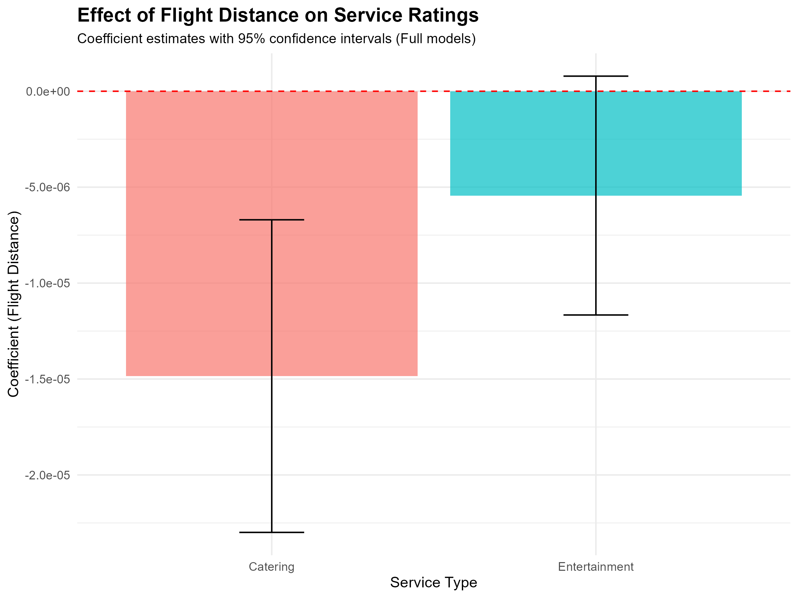
} else {
  cat("Figure not yet generated. Please run the analysis script.")
}
```

\FloatBarrier

Figure 3.2.3 shows coefficient estimates with 95% confidence intervals. The horizontal line marks zero—values above indicate higher ratings as distance grows. After controlling for other factors, entertainment shows no significant effect (coefficient = `r sprintf("%.6f", ent_coef)`, p = `r sprintf("%.3f", ent_pval)`). For catering, the coefficient is `r sprintf("%.6f", cat_coef)` (p = `r sprintf("%.4f", cat_pval)`), indicating passengers rate catering **lower** on longer flights, contrary to the initial hypothesis, likely reflecting higher expectations for meal quality.

### 3.3 How do business and personal travelers trade off schedule convenience versus onboard comfort in shaping their satisfaction?

This section examines whether business and personal travelers differ in weighing schedule convenience and onboard comfort. Using 103,904 observations, we model satisfaction as binary in logistic regression with interaction terms. Schedule convenience is measured by departure/arrival time rating; onboard comfort is a composite of seat comfort, legroom, entertainment, service, and food.


```{r rq3-data-prep, include=FALSE, message=FALSE, warning=FALSE}
# RQ3 Data Preparation
suppressPackageStartupMessages({
  library(dplyr)
  library(ggplot2)
  library(readr)
  library(broom)
  library(tidyr)
  library(scales)
})

# Load and prepare data for RQ3
# readr::read_csv preserves original column names, so we use backticks for names with spaces/slashes
rq3_df <- read_csv("dataset/train.csv", show_col_types = FALSE) %>%
  select(
    satisfaction,
    `Type of Travel`,
    `Departure/Arrival time convenient`,
    `Seat comfort`,
    `Inflight entertainment`,
    `Leg room service`,
    `On-board service`,
    `Food and drink`
  ) %>%
  drop_na() %>%
  mutate(
    satisfaction_bin = ifelse(satisfaction == "satisfied", 1L, 0L),
    BusinessTravel = ifelse(`Type of Travel` == "Business travel", 1L, 0L),
    time_score = as.numeric(`Departure/Arrival time convenient`),
    comfort_score = rowMeans(
      across(c(
        `Seat comfort`,
        `Leg room service`,
        `Inflight entertainment`,
        `On-board service`,
        `Food and drink`
      ), as.numeric),
      na.rm = TRUE
    ),
    `Type of Travel` = factor(`Type of Travel`)
  )

# Fit logistic regression model with interactions
rq3_model <- glm(
  satisfaction_bin ~ time_score * BusinessTravel + comfort_score * BusinessTravel,
  data = rq3_df,
  family = binomial(link = "logit")
)

rq3_tidy <- tidy(rq3_model, conf.int = TRUE)

# Calculate odds ratios
rq3_coefs <- coef(rq3_model)
beta_time_P <- rq3_coefs[["time_score"]]
beta_conf_P <- rq3_coefs[["comfort_score"]]
beta_time_B <- beta_time_P + rq3_coefs[["time_score:BusinessTravel"]]
beta_conf_B <- beta_conf_P + rq3_coefs[["BusinessTravel:comfort_score"]]

OR_time_P <- exp(beta_time_P)
OR_conf_P <- exp(beta_conf_P)
OR_time_B <- exp(beta_time_B)
OR_conf_B <- exp(beta_conf_B)

# Extract interaction coefficients
interaction_time_coef <- rq3_tidy$estimate[rq3_tidy$term == "time_score:BusinessTravel"]
interaction_time_p <- rq3_tidy$p.value[rq3_tidy$term == "time_score:BusinessTravel"]
interaction_comfort_coef <- rq3_tidy$estimate[rq3_tidy$term == "BusinessTravel:comfort_score"]
interaction_comfort_p <- rq3_tidy$p.value[rq3_tidy$term == "BusinessTravel:comfort_score"]
```


Figure 3.3.1 shows a large baseline gap: 58.3% of business travelers are satisfied versus 10.2% of personal travelers. Figures 3.3.2–3.3.3 show business travelers report higher convenience and comfort.


```{r rq3-fig1, echo=FALSE, fig.cap="Figure 3.3.1 Satisfaction rate by travel type", fig.pos='H', out.width="65%"}
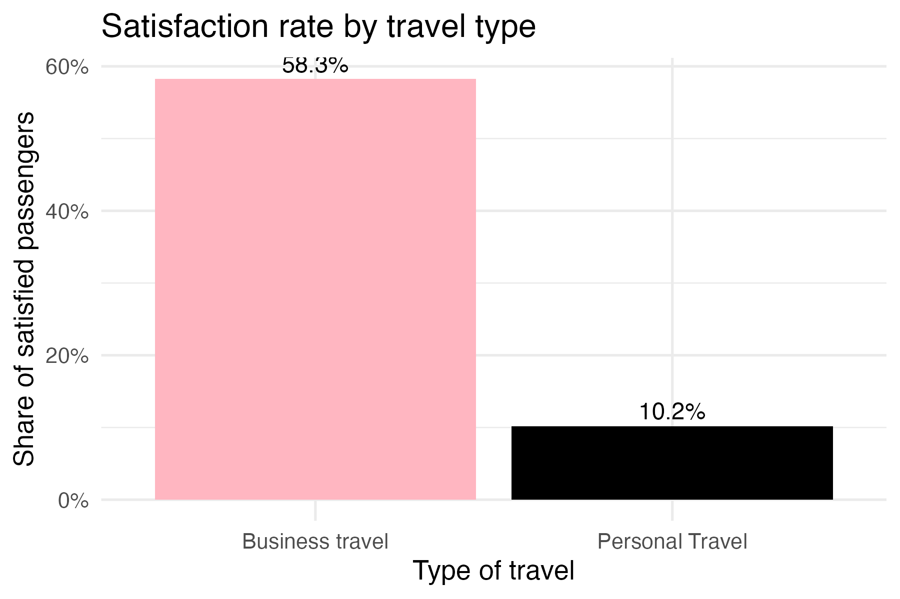
```

\FloatBarrier

```{r rq3-fig2, echo=FALSE, fig.cap="Figure 3.3.2 Distribution of schedule convenience score", fig.pos='H', out.width="70%"}
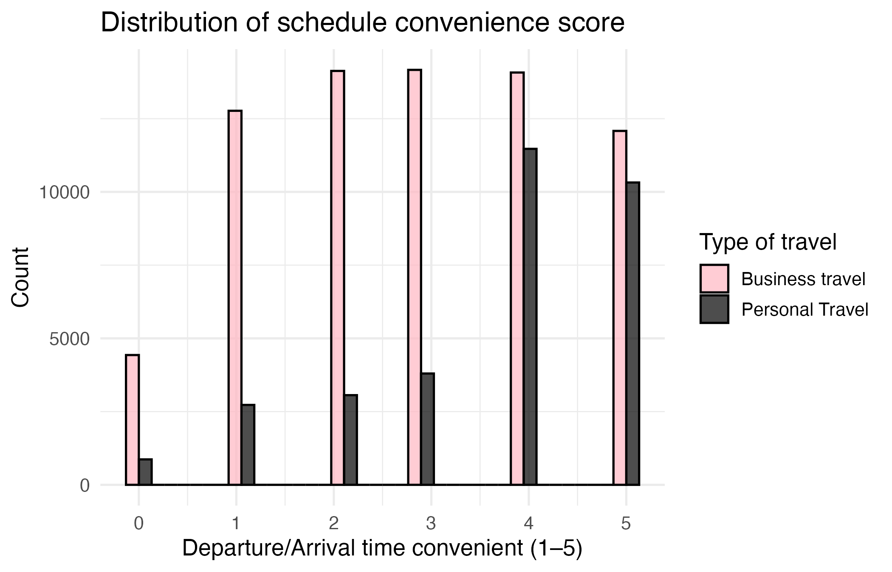
```

\FloatBarrier

```{r rq3-fig3, echo=FALSE, fig.cap="Figure 3.3.3 Distribution of onboard comfort score", fig.pos='H', out.width="70%"}
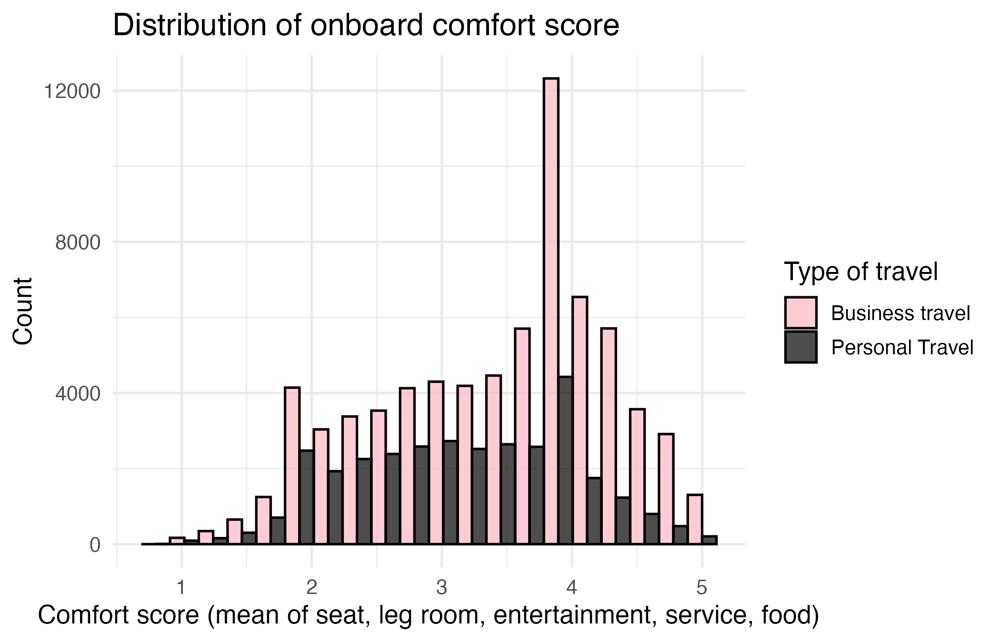
```

\FloatBarrier

The logistic regression model with interaction terms is specified as:

\begin{align}
\text{logit}\{\Pr(\text{Satisfaction} = 1)\} &= \beta_0 + \beta_1 \text{Time} + \beta_2 \text{Comfort} + \beta_3 \text{BusinessTravel} \nonumber \\
&\quad + \beta_4 (\text{Time} \times \text{BusinessTravel}) + \beta_5 (\text{Comfort} \times \text{BusinessTravel}),
\end{align}

Results (Figure 3.3.4) reveal strong heterogeneity: personal travelers show minimal sensitivity, while business travelers respond strongly to both attributes, with each one-point comfort increase multiplying satisfaction odds by more than five.


```{r rq3-fig4-coef, echo=FALSE, fig.cap="Figure 3.3.4 Effects of time and comfort on satisfaction: Odds ratios by travel type", fig.pos='H', out.width="70%"}
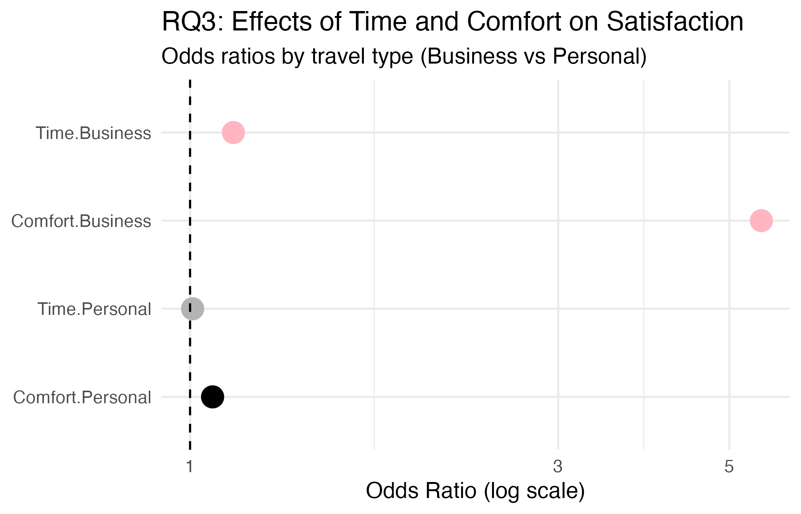
```

\FloatBarrier
Effect plots (Figures 3.3.5–3.3.6) confirm this: personal travelers' satisfaction remains flat, while business travelers' satisfaction rises with time and sharply with comfort.

```{r rq3-fig5-time, echo=FALSE, fig.cap="Figure 3.3.5 Effect of schedule convenience on satisfaction", fig.pos='H', out.width="70%"}
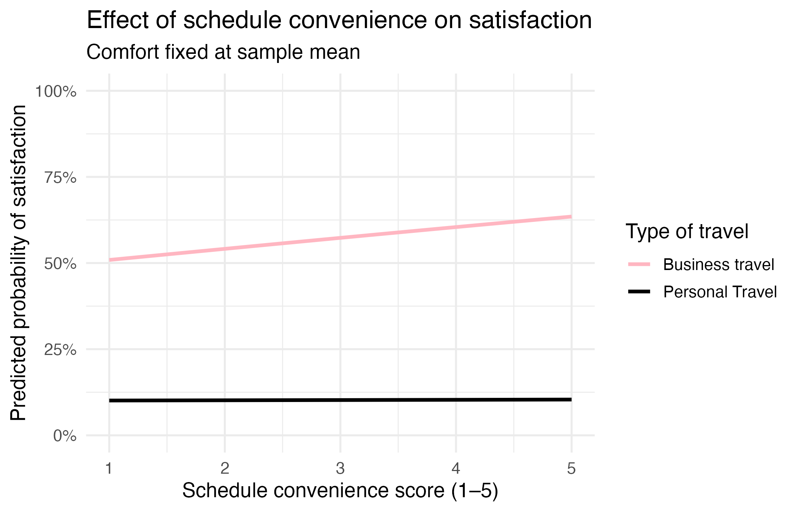
```

\FloatBarrier

```{r rq3-fig6-comfort, echo=FALSE, fig.cap="Figure 3.3.6 Effect of onboard comfort on satisfaction", fig.pos='H', out.width="70%"}
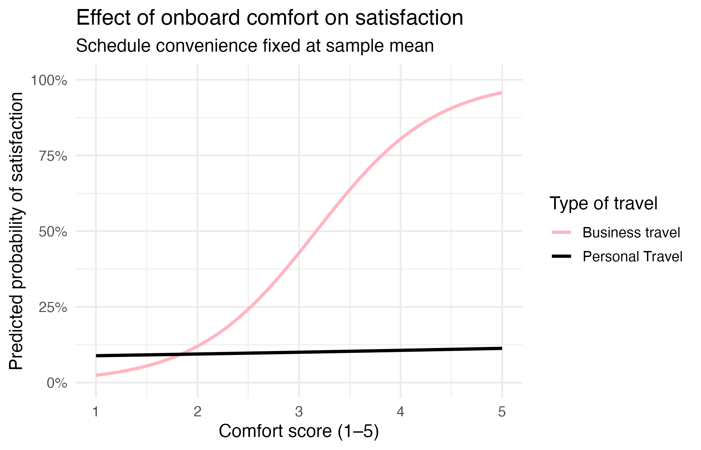
```

\FloatBarrier

### 3.4 What are the moderating effects of the intersection of cabin class and flight distance on certain service attributes and passenger satisfaction?

Service perception varies with travel context—long-haul vs short-haul and cabin class willingness to pay.

#### 3.4.1 Heatmap of Average Ratings

\medskip


```{r fig-heatmap-q4, echo=FALSE, fig.cap="Figure 3.5 Heatmap of Average Ratings", fig.pos='H', out.width="75%"}
if (!is.null(heatmap_q4) && nrow(heatmap_q4) > 0) {
  ggplot(heatmap_q4, aes(x = service, y = cabin_distance, fill = mean_score)) +
    geom_tile(color = "white", size = 0.2) +
    scale_fill_viridis_c(option = "C", na.value = "grey90", limits = c(1, 5)) +
    labs(
      x = "Service",
      y = "Cabin Class × Flight Distance",
      fill = "Avg rating"
    ) +
    theme_minimal(base_size = 12) +
    theme(
      axis.text.x = element_text(angle = 40, hjust = 1),
      axis.text.y = element_text(size = 8),
      panel.grid = element_blank()
    )
} else {
  cat("Heatmap data is not available.")
}
```

\FloatBarrier

The heatmap shows a "comfort gap" widening with distance: Business class remains high, while Economy and Eco Plus scores plummet on long-haul flights.

#### 3.4.2 Top-5 Services by Cabin Class × Flight Distance

\medskip


```{r fig-top5-q4, echo=FALSE, fig.cap="Figure 3.6 Top-5 Services by Cabin Class × Flight Distance", fig.pos='H', out.width="85%"}
if (!is.null(top5_q4) && nrow(top5_q4) > 0) {
  ggplot(top5_q4, aes(x = reorder(service, mean_score), y = mean_score, fill = mean_score)) +
    geom_col(width = 0.7, show.legend = FALSE) +
    geom_text(aes(label = sprintf("%.2f", mean_score)), hjust = -0.15, size = 2.5) +
    coord_flip() +
    facet_wrap(~ cabin_distance, scales = "free_y", ncol = 3) +
    scale_fill_viridis_c(option = "C", limits = c(1, 5), guide = "none") +
    scale_y_continuous(limits = c(0, 5.2)) +
    labs(
      x = "Service",
      y = "Average rating"
    ) +
    theme_minimal(base_size = 11) +
    theme(
      axis.text = element_text(size = 7),
      strip.text = element_text(size = 8),
      panel.grid.major.y = element_blank(),
      panel.grid.minor = element_blank()
    )
} else {
  cat("Top-5 data is not available.")
}
```

\FloatBarrier

Priorities shift from operational efficiency on short-haul to physical needs like seat comfort and entertainment on long-haul, with legroom becoming critical in Economy.

#### 3.4.3 K–S Test: Distribution Differences (Eco Plus Short-haul vs. Long-haul)

\medskip


```{r fig-ks-q4, echo=FALSE, fig.cap="Figure 3.7 K–S Test Results (Eco Plus Short vs. Long)", fig.pos='H', out.width="65%"}
if (!is.null(ks_results_q4) && nrow(ks_results_q4) > 0) {
  ggplot(ks_results_q4, aes(x = reorder(service, p_value), y = -log10(p_value))) +
    geom_col(fill = "#4C78A8") +
    geom_hline(yintercept = -log10(0.05), linetype = "dashed", color = "red") +
    coord_flip() +
    labs(
      x = "Service",
      y = expression(-log[10](p)),
      title = paste("K–S Test:", ks_results_q4$group_a[1], "vs", ks_results_q4$group_b[1])
    ) +
    theme_minimal(base_size = 12)
} else {
  cat("K–S test results are not available (insufficient data).")
}
```

\FloatBarrier

Statistical tests confirm duration fundamentally alters perception, revealing significant differences in inflight service and legroom, suggesting passengers scrutinize service more on longer trips.

#### 3.4.4 ANOVA: Interaction Effects

\medskip


```{r fig-anova-q4, echo=FALSE, fig.cap="Figure 3.8 ANOVA Interaction Effects", fig.pos='H', out.width="65%"}
if (!is.null(anova_results_q4) && nrow(anova_results_q4) > 0) {
  anova_plot_data <- anova_results_q4 |>
    dplyr::mutate(neg_log10_p = -log10(Interaction_p))
  
  ggplot(anova_plot_data, aes(x = reorder(service, Interaction_p), y = neg_log10_p)) +
    geom_col(fill = "#2E7D32", alpha = 0.8) +
    geom_hline(yintercept = -log10(0.05), linetype = "dashed", color = "red") +
    coord_flip() +
    labs(
      x = "Service",
      y = expression(-log[10](p) ~ "for Interaction")
    ) +
    theme_minimal(base_size = 12)
} else {
  cat("ANOVA results are not available.")
}
```

\FloatBarrier

"Seat comfort" shows a massive interaction effect, confirming comfort value depends on cabin-distance combinations; "Inflight entertainment" also shows strong interaction, discouraging uniform strategies.


#### 3.4.5 Conclusion for Q4

Premium cabins mitigate the "distance penalty," suggesting airlines must focus investment on soft products and physical comfort for low-satisfaction long-haul Economy sectors.


### 3.5 Can we accurately predict passenger satisfaction, and which factors are the most important predictors?

This question examines whether satisfaction can be predicted accurately and which attributes drive predictions. We apply tree-based machine learning models with cross-validation to evaluate performance and derive feature importance.

#### 3.5.1 Modelling approach

Satisfaction is modeled as binary. Predictors include 14 service ratings, an engineered service_score, operational variables (age, distance, delays), and travel characteristics. Data are split 80/20 with stratified sampling. We estimate Random Forest and XGBoost classifiers using 5-fold cross-validation.

#### 3.5.2 Overall predictive performance

Both models achieve strong performance. XGBoost slightly outperforms Random Forest in accuracy and AUC, with balanced sensitivity and specificity. ROC curves and confusion matrices confirm good discrimination, substantially improving upon naïve baselines.
```{r fig-accuracy, echo=FALSE, fig.cap="Figure 5.1 Model accuracy comparison", fig.pos='H', out.width="65%"}
knitr::include_graphics("output/zliu134/figures/01_accuracy_comparison.png")
```

#### 3.5.3 Most important predictors of satisfaction

Feature importance shows **service quality dominates**. **Online boarding** and **inflight wifi** are the most influential, followed by comfort-related services and the composite **service_score**. Travel context (business travel and class) is also important, while operational factors play a secondary role.

#### 3.5.4 How do key features shape satisfaction? (Partial dependence)

Partial dependence analysis shows a strong, monotonic positive relationship between **online boarding quality** and predicted satisfaction, holding other factors constant.
```{r fig-pdp, echo=FALSE, fig.cap="Figure 5.7 Partial dependence plot for Online boarding (top predictor)", fig.pos='H', out.width="65%"}
knitr::include_graphics("output/zliu134/figures/07_pdp_Online_boarding.png")
```
#### 3.5.5 Conclusion for RQ5

Satisfaction can be predicted with high accuracy. Results highlight service quality—especially digital touchpoints—as the primary driver, offering clear guidance for prioritization.

## 4. Insight Gained

Through our comprehensive analysis, we have gained several key insights with important implications for airline operations. First, service preferences show high differentiation across age groups: younger passengers prioritize digital touchpoints like online check-in and in-flight Wi-Fi, while older passengers value seat comfort and manual services more, indicating the need for age-differentiated service strategies. Second, flight distance fundamentally changes evaluation mechanisms—dining scores decrease on longer flights despite more usage opportunities, as higher expectations lead to stricter evaluations. Third, satisfaction formation differs dramatically between business and personal travelers: business travelers are highly sensitive to time efficiency and in-flight comfort, with comfort significantly multiplying satisfaction odds, while personal travelers show limited responsiveness to these attributes, suggesting distinct resource allocation strategies. Fourth, cabin class and flight duration interactions create strong experience gaps—economy class satisfaction plummets on long-haul flights while business class remains stable, with seat comfort and legroom showing extreme importance in this interaction, highlighting the need to focus improvements on vulnerable combinations like long-haul economy. Finally, service quality impacts satisfaction far more than operational indicators like delays, emphasizing that passengers prioritize service quality over occasional operational disturbances when evaluating satisfaction.

## 5. Project Adjustment & Lesson Learned

We refined research questions from broad topics to focused analyses on age differences, passenger types, and cabin-route interactions. Combining statistical models for mechanism understanding and machine learning for prediction enhanced research completeness. Effective team collaboration and clear task division enabled parallel progress and timely course corrections.

## 6. Team Collaboration

Clear task division based on research questions enabled parallel work and reduced redundancy. Weekly discussions and shared code ensured reproducibility and consistent quality throughout the project.

## 7. Future Directions

Future research could incorporate route categories, seasonal changes, and sentiment analysis of passenger comments. The predictive models can support personalized service recommendations and operational optimization.


## 8. Conclusion

This study reveals significant heterogeneity in satisfaction formation across age, passenger type, cabin class, and flight distance. Digital services are core to modern aviation, while physical comfort matters most on long-haul economy flights. Service quality, not operational disturbances, drives satisfaction, guiding airlines toward differentiated and digital-focused strategies.

## Appendix

### A.1 Detailed Analysis: Relationship between Passenger Satisfaction, Age, and Service Demands

This section provides a comprehensive analysis of how service priorities shift across age groups and how these differences relate to overall passenger satisfaction.

The heatmap of average service ratings by age group visualizes scores for all 14 service dimensions across different demographic segments. Across nearly all age groups, Inflight service, Baggage handling, and Seat comfort consistently receive high ratings. The <18 group shows distinctly lower evaluations for Inflight wifi and Online booking, suggesting less engagement with digital service interfaces. Passengers aged 46–55 and 56–65 show more uniform ratings, indicating consistent expectations across service dimensions. 66+ passengers show lower ratings for several technologically oriented services, implying potential digital accessibility concerns.

The Top-5 services analysis reveals distinct priorities across age groups. For <18, Inflight service, Baggage handling, and Departure/Arrival convenience dominate. For 18–25 and 26–35, technology-enabled services become more important. 36–55 groups show balanced appreciation across comfort, baggage, and entertainment. 66+ prioritizes Seat comfort, Inflight service, and Baggage handling, indicating the importance of physical comfort and ease of travel support.

To statistically measure whether ratings differ across age groups, we performed a Two-Sample Kolmogorov–Smirnov test comparing the youngest group (<18) and the oldest (66+) across all services. The results show that online boarding, Inflight service, Baggage handling, and Seat comfort exhibit extremely significant differences (p << 0.001). These are core operational or digital touchpoints, suggesting younger and older passengers perceive them differently. Attributes such as Inflight wifi or Entertainment show minimal differences, implying similar distribution patterns across generations.

To analyze which services most strongly predict satisfaction while controlling for age group, we ran a logistic regression model. The results show that services such as online boarding, inflight wifi, leg room service, and inflight entertainment significantly increase the likelihood of satisfaction, even after controlling for other variables. The model also includes age-related polynomial terms (age_group.L, age_group.Q, and higher-order contrasts) to capture nonlinear demographic effects. These terms represent overall age trends rather than specific age groups, and their significance indicates that age-related patterns influence satisfaction, complementing the effects of individual service ratings. We include quadratic and higher-order polynomial terms because the relationship between age and satisfaction may not be linear—satisfaction might peak in middle age groups or exhibit complex S-shaped patterns across the lifespan.

In summary, different age groups prioritize different service attributes. Younger groups emphasize digital services, while older groups emphasize comfort and travel assistance. Distribution differences are statistically significant for several services, confirming that age shapes service perception. Age is a meaningful moderator of service experience, and airlines can improve satisfaction by enhancing digital touchpoints for younger passengers, enhancing comfort and support for older passengers, and ensuring high reliability in universal services like baggage handling and inflight service.

### 3.5.3 Figures and details


```{r fig-top-features, echo=FALSE, fig.cap="Figure 5.5 Top 15 most important predictors (average of both models)", fig.pos='H', out.width="75%"}
knitr::include_graphics("output/zliu134/figures/04_top_features_combined.png")
```

```{r fig-feature-compare, echo=FALSE, fig.cap="Figure 5.6 Feature importance: RF vs XGBoost comparison", fig.pos='H', out.width="75%"}
knitr::include_graphics("output/zliu134/figures/05_feature_importance_comparison.png")
```

## Feedback Incorporation

In response to feedback received during the project review, we have incorporated the following suggestions:

1. Why did you include different age variables (age^2?) - did I hear it correctly?

2. How to interpret the graph on RQ2? What's the red line?

3. Would have been better if the coefficients in the visualizations were more clearly interpreted.