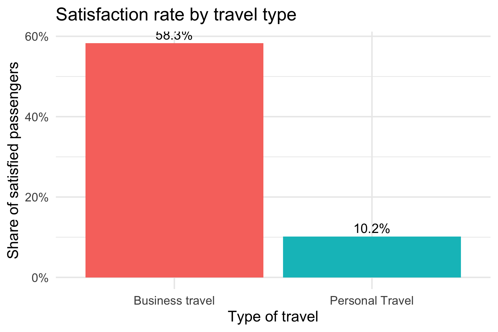
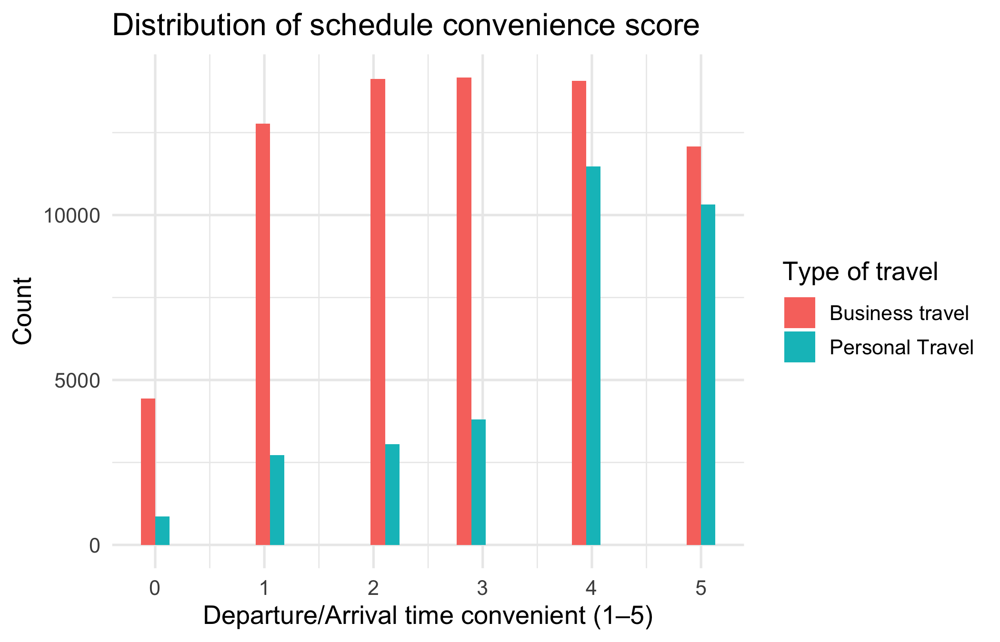

```{r setup, include=FALSE}
knitr::opts_chunk$set(echo = TRUE, warning = FALSE, message = FALSE, fig.width = 10, fig.height = 6)
```

## 1. Introduction

In today's aviation industry, passenger satisfaction has increasingly become an important competitive indicator for airlines. However, passenger satisfaction, as a relatively subjective indicator, is often difficult to comprehensively measure and predict due to the interaction of multiple factors such as age, travel purpose, cabin class, and in-flight service quality. This has brought great challenges to airlines on how to improve services to better meet passenger needs and enhance customer loyalty. A systematic data-driven approach helps determine how these elements jointly impact passenger satisfaction. Through data analysis, airlines can design targeted strategies to improve satisfaction and retain more customers.

We structure our analysis around five research questions.

1. What is the relationship between passengers' overall satisfaction and their age as well as service demands?
2. Do passengers place higher ratings or importance on "entertainment" and "catering" for longer flights?
3. How do business and personal travelers trade off schedule convenience versus onboard comfort in shaping their satisfaction?
4. What are the moderating effects of the intersection of cabin class and flight distance on certain service attributes and passenger satisfaction?
5. Can we accurately predict passenger satisfaction, and which factors are the most important predictors?

## 2. Dataset Overview

This study uses the Airline Passenger Satisfaction dataset from Kaggle, which includes responses from real air passengers. The dataset contains a training set of 103,904 records and a test set of 25,976 records, each with 25 variables describing passenger demographics and flight experiences.

Key variables include gender, age, customer type, travel type, cabin class, and flight distance, along with 14 service-related ratings (e.g., seat comfort, cleanliness, food and drink, Wi-Fi service) measured on a 0–5 scale. Flight delays are also recorded. The dependent variable “Satisfaction” is binary: “satisfied” vs. “neutral/dissatisfied”. These variables together provide a solid foundation for exploring the relationships between service dimensions, demographics, and satisfaction outcomes.

```{r data-prep, include=FALSE, message=FALSE, warning=FALSE}
library(tidyverse)
library(broom)

read_one <- function(path, tag) {
  readr::read_csv(path, show_col_types = FALSE) |>
    dplyr::mutate(.dataset = tag)
}

train_df <- read_one("dataset/train.csv", "train")
test_df  <- read_one("dataset/test.csv",  "test")
raw_df   <- dplyr::bind_rows(train_df, test_df)

service_columns <- c(
  "Inflight wifi service",
  "Departure/Arrival time convenient",
  "Ease of Online booking",
  "Gate location",
  "Food and drink",
  "Online boarding",
  "Seat comfort",
  "Inflight entertainment",
  "On-board service",
  "Leg room service",
  "Baggage handling",
  "Checkin service",
  "Inflight service",
  "Cleanliness"
)
service_columns <- intersect(service_columns, colnames(raw_df))

age_breaks <- c(-Inf, 17, 25, 35, 45, 55, 65, Inf)
age_labels <- c("<18", "18-25", "26-35", "36-45", "46-55", "56-65", "66+")

df <- raw_df |>
  dplyr::filter(!is.na(Age)) |>
  dplyr::mutate(
    age_group = cut(Age, breaks = age_breaks, labels = age_labels, right = TRUE, ordered_result = TRUE)
  ) |>
  dplyr::mutate(dplyr::across(dplyr::all_of(service_columns), as.numeric))

long_scores <- df |>
  tidyr::pivot_longer(
    cols = dplyr::all_of(service_columns),
    names_to = "service",
    values_to = "score"
  ) |>
  dplyr::mutate(score = dplyr::na_if(score, 0))

summary_scores <- long_scores |>
  dplyr::group_by(age_group, service) |>
  dplyr::summarise(
    mean_score = mean(score, na.rm = TRUE),
    n_rated = sum(!is.na(score)),
    .groups = "drop"
  )

topk <- 5
top5_by_age <- summary_scores |>
  dplyr::group_by(age_group) |>
  dplyr::arrange(dplyr::desc(mean_score), .by_group = TRUE) |>
  dplyr::slice_head(n = topk) |>
  dplyr::ungroup() |>
  dplyr::mutate(service = forcats::fct_reorder(service, mean_score))

available_age_groups <- unique(na.omit(df$age_group))
available_age_groups <- available_age_groups[order(available_age_groups)]
ks_pair <- as.character(c(head(available_age_groups, 1), tail(available_age_groups, 1)))

ks_results <- NULL
if (length(ks_pair) == 2) {
  ks_results <- purrr::map_dfr(service_columns, function(sv) {
    sub_data <- long_scores |>
      dplyr::filter(service == sv, !is.na(age_group), !is.na(score), age_group %in% ks_pair)
    g1 <- sub_data |>
      dplyr::filter(age_group == ks_pair[1]) |>
      dplyr::pull(score)
    g2 <- sub_data |>
      dplyr::filter(age_group == ks_pair[2]) |>
      dplyr::pull(score)
    if (length(g1) >= 10 && length(g2) >= 10) {
      ks <- suppressWarnings(stats::ks.test(g1, g2))
      tibble::tibble(
        service = sv,
        group_a = ks_pair[1],
        group_b = ks_pair[2],
        statistic = unname(ks$statistic),
        p_value = ks$p.value
      )
    } else {
      tibble::tibble(
        service = sv,
        group_a = ks_pair[1],
        group_b = ks_pair[2],
        statistic = NA_real_,
        p_value = NA_real_
      )
    }
  })
}

logit_df <- df |>
  dplyr::mutate(
    satisfaction_binary = dplyr::case_when(
      !is.na(satisfaction) & satisfaction == "satisfied" ~ 1L,
      !is.na(satisfaction) ~ 0L,
      TRUE ~ NA_integer_
    )
  ) |>
  dplyr::mutate(dplyr::across(dplyr::all_of(service_columns), ~ dplyr::na_if(.x, 0))) |>
  dplyr::select(satisfaction_binary, age_group, dplyr::all_of(service_columns)) |>
  tidyr::drop_na()

logit_top_terms <- NULL
if (nrow(logit_df) > 100) {
  rhs <- paste(c("age_group", paste0("`", service_columns, "`")), collapse = " + ")
  fml <- stats::as.formula(paste0("satisfaction_binary ~ ", rhs))
  logit_fit <- stats::glm(fml, data = logit_df, family = stats::binomial())
  logit_tidy <- broom::tidy(logit_fit, conf.int = TRUE, exponentiate = TRUE) |>
    dplyr::mutate(
      term_clean = stringr::str_replace_all(term, "`", ""),
      is_age = stringr::str_starts(term_clean, "age_group")
    ) |>
    dplyr::filter(term != "(Intercept)")
  logit_top_terms <- logit_tidy |>
    dplyr::arrange(p.value) |>
    dplyr::slice_head(n = 20) |>
    dplyr::mutate(term_clean = forcats::fct_reorder(term_clean, estimate))
}

# Q4: Cabin Class × Flight Distance Analysis
cabin_col <- dplyr::coalesce(
  if ("Class" %in% colnames(raw_df)) "Class" else NULL,
  if ("Cabin.Class" %in% colnames(raw_df)) "Cabin.Class" else NULL,
  grep("class|Class", colnames(raw_df), ignore.case = TRUE, value = TRUE)[1]
)

distance_var <- dplyr::case_when(
  "Flight.Distance" %in% colnames(raw_df) ~ "Flight.Distance",
  "Flight Distance" %in% colnames(raw_df) ~ "Flight Distance",
  TRUE ~ NA_character_
)

df_q4 <- raw_df |>
  dplyr::filter(!is.na(.data[[cabin_col]])) |>
  dplyr::mutate(
    satisfaction_binary_q4 = dplyr::case_when(
      !is.na(satisfaction) & satisfaction == "satisfied" ~ 1L,
      !is.na(satisfaction) ~ 0L,
      TRUE ~ NA_integer_
    )
  )

if (!is.na(distance_var)) {
  df_q4 <- df_q4 |>
    dplyr::filter(!is.na(.data[[distance_var]])) |>
    dplyr::mutate(
      distance_category = cut(
        .data[[distance_var]],
        breaks = c(0, 1000, 3000, Inf),
        labels = c("Short-haul (<1000km)", "Medium-haul (1000-3000km)", "Long-haul (>3000km)"),
        include.lowest = TRUE
      ),
      cabin_distance = interaction(.data[[cabin_col]], distance_category, sep = " × ", drop = TRUE),
      cabin_factor = as.factor(.data[[cabin_col]]),
      distance_factor = as.factor(distance_category)
    ) |>
    dplyr::mutate(dplyr::across(dplyr::all_of(service_columns), ~ dplyr::na_if(as.numeric(.x), 0)))
}

# Q4 Heatmap data
heatmap_q4 <- NULL
if (exists("df_q4") && "cabin_distance" %in% colnames(df_q4)) {
  heatmap_q4 <- df_q4 |>
    tidyr::pivot_longer(
      cols = dplyr::all_of(service_columns),
      names_to = "service",
      values_to = "score"
    ) |>
    dplyr::group_by(cabin_distance, service) |>
    dplyr::summarise(
      mean_score = mean(score, na.rm = TRUE),
      .groups = "drop"
    )
}

# Q4 Top-5 by cabin_distance
top5_q4 <- NULL
if (!is.null(heatmap_q4)) {
  top5_q4 <- heatmap_q4 |>
    dplyr::group_by(cabin_distance) |>
    dplyr::arrange(dplyr::desc(mean_score), .by_group = TRUE) |>
    dplyr::slice_head(n = 5) |>
    dplyr::ungroup()
}

# Q4 K-S Test: Compare Eco Plus Short-haul vs Long-haul
ks_results_q4 <- NULL
if (exists("df_q4") && "cabin_distance" %in% colnames(df_q4)) {
  cabin_distance_levels <- unique(na.omit(df_q4$cabin_distance))
  eco_plus_levels <- cabin_distance_levels[grepl("Eco Plus", as.character(cabin_distance_levels))]
  
  if (length(eco_plus_levels) >= 2) {
    group1_q4 <- eco_plus_levels[grepl("Short", as.character(eco_plus_levels))][1]
    group2_q4 <- eco_plus_levels[grepl("Long", as.character(eco_plus_levels))][1]
    
    if (!is.na(group1_q4) && !is.na(group2_q4)) {
      ks_results_q4 <- purrr::map_dfr(service_columns, function(sv) {
        sub_data <- df_q4 |>
          dplyr::filter(cabin_distance %in% c(group1_q4, group2_q4), !is.na(.data[[sv]]))
        g1 <- sub_data |>
          dplyr::filter(cabin_distance == group1_q4) |>
          dplyr::pull(sv)
        g2 <- sub_data |>
          dplyr::filter(cabin_distance == group2_q4) |>
          dplyr::pull(sv)
        if (length(g1) >= 10 && length(g2) >= 10) {
          ks <- suppressWarnings(stats::ks.test(g1, g2))
          tibble::tibble(
            service = sv,
            group_a = as.character(group1_q4),
            group_b = as.character(group2_q4),
            statistic = unname(ks$statistic),
            p_value = ks$p.value
          )
        } else {
          tibble::tibble(
            service = sv,
            group_a = as.character(group1_q4),
            group_b = as.character(group2_q4),
            statistic = NA_real_,
            p_value = NA_real_
          )
        }
      })
    }
  }
}

# Q4 ANOVA: Interaction effects
anova_results_q4 <- NULL
if (exists("df_q4") && "cabin_factor" %in% colnames(df_q4) && "distance_factor" %in% colnames(df_q4)) {
  anova_results_q4 <- purrr::map_dfr(service_columns, function(sv) {
    model <- stats::aov(df_q4[[sv]] ~ df_q4$cabin_factor * df_q4$distance_factor, data = df_q4)
    smry <- summary(model)[[1]]
    tibble::tibble(
      service = sv,
      Cabin_F = smry$`F value`[1],
      Distance_F = smry$`F value`[2],
      Interaction_F = smry$`F value`[3],
      Cabin_p = smry$`Pr(>F)`[1],
      Distance_p = smry$`Pr(>F)`[2],
      Interaction_p = smry$`Pr(>F)`[3]
    )
  }) |>
    dplyr::arrange(Interaction_p)
}
```

## 3. Research Question Analysis

### 3.1 What is the relationship between passengers' overall satisfaction and their age as well as service demands?

This question aims to determine how service priorities shift across age groups. Understanding age-differentiated service needs can help airlines tailor offerings—for example, improving digital experiences for younger travelers or enhancing comfort for older passengers.

#### 3.1.1 Heatmap of Average Ratings

\medskip

The heatmap below visualizes average scores for all 14 service dimensions by age group:

```{r fig-heatmap, echo=FALSE, fig.cap="Figure 3.1 Average service ratings by age group", fig.pos='H', out.width="75%"}
heatmap_plot <- ggplot(summary_scores, aes(x = service, y = age_group, fill = mean_score)) +
  geom_tile(color = "white", size = 0.2) +
  scale_fill_viridis_c(option = "C", na.value = "grey90", limits = c(1, 5)) +
  labs(
    x = "Service",
    y = "Age group",
    fill = "Avg rating"
  ) +
  theme_minimal(base_size = 12) +
  theme(
    axis.text.x = element_text(angle = 40, hjust = 1),
    panel.grid = element_blank()
  )
heatmap_plot
```

\FloatBarrier

The figure shows that, across nearly all age groups, Inflight service, Baggage handling, and Seat comfort consistently receive high ratings. The <18 group shows distinctly lower evaluations for Inflight wifi and Online booking, suggesting less engagement with digital service interfaces. Passengers aged 46–55 and 56–65 show more uniform ratings, indicating consistent expectations across service dimensions. 66+ passengers show lower ratings for several technologically oriented services, implying potential digital accessibility concerns.

#### 3.1.2 Top-5 Services by Age Group

\medskip

To highlight priorities clearly, the following figure presents the Top-5 service dimensions for each age group:

```{r fig-top5, echo=FALSE, fig.cap="Figure 3.2 Top-5 services by age group", fig.pos='H', out.width="80%"}
bar_plot <- ggplot(top5_by_age, aes(x = service, y = mean_score, fill = age_group)) +
  geom_col(width = 0.7, show.legend = FALSE) +
  geom_text(aes(label = sprintf("%.2f", mean_score)), hjust = -0.15, size = 3) +
  coord_flip() +
  facet_wrap(~ age_group, scales = "free_y") +
  scale_y_continuous(limits = c(0, 5.2)) +
  labs(
    x = "Service",
    y = "Average rating"
  ) +
  theme_minimal(base_size = 12) +
  theme(
    panel.grid.major.y = element_blank(),
    panel.grid.minor = element_blank()
  )
bar_plot
```

\FloatBarrier

The figure indicates that, for <18, Inflight service, Baggage handling, and Departure/Arrival convenience dominate. For 18–25 and 26–35, technology-enabled services become more important. 36–55 groups show balanced appreciation across comfort, baggage, and entertainment. 66+ prioritizes Seat comfort, Inflight service, and Baggage handling, indicating the importance of physical comfort and ease of travel support.

#### 3.1.3 K–S Test: Distribution Differences in Service Ratings

\medskip

To statistically measure whether ratings differ in location across age groups, we performed a Two-Sample Kolmogorov–Smirnov test, comparing the youngest group (<18) and the oldest (66+) across all services.

```{r fig-ks, echo=FALSE, fig.cap="Figure 3.3 K–S test results", fig.pos='H', out.width="65%"}
if (!is.null(ks_results) && nrow(ks_results) > 0) {
  ggplot(ks_results, aes(x = reorder(service, p_value), y = -log10(p_value))) +
    geom_col(fill = "#4C78A8") +
    geom_hline(yintercept = -log10(0.05), linetype = "dashed", color = "red") +
    coord_flip() +
    labs(
      x = "Service",
      y = expression(-log[10](p))
    ) +
    theme_minimal(base_size = 12)
} else {
  cat("K–S test results are not available (insufficient data).")
}
```

\FloatBarrier

The figure shows that online boarding, Inflight service, Baggage handling, and Seat comfort show extremely significant differences (p << 0.001). These are core operational or digital touchpoints—suggesting younger and older passengers perceive them differently. Attributes such as Inflight wifi or Entertainment show minimal differences, implying similar distribution patterns across generations.

#### 3.1.4 Logistic Regression: Factors Associated with Satisfaction

\medskip

To analyze which services most strongly predict satisfaction while controlling for age group, we ran a logistic regression:

```{r fig-logit, echo=FALSE, fig.cap="Figure 3.4 Logistic regression", fig.pos='H', out.width="70%"}
if (!is.null(logit_top_terms) && nrow(logit_top_terms) > 0) {
  ggplot(logit_top_terms, aes(x = term_clean, y = estimate)) +
    geom_pointrange(aes(ymin = conf.low, ymax = conf.high), color = "#F58518") +
    geom_hline(yintercept = 1, linetype = "dashed", color = "grey40") +
    coord_flip() +
    labs(
      x = "Variables",
      y = "Odds ratio (OR)"
    ) +
    theme_minimal(base_size = 12) +
    theme(
      plot.title.position = "plot",
      plot.margin = margin(t = 10, r = 24, b = 10, l = 10)
    )
} else {
  cat("Logistic regression results are not available (insufficient data).")
}
```

\FloatBarrier

The logistic regression plot shows the service factors most strongly associated with passenger satisfaction. Each dot represents an odds ratio (OR) and the horizontal line is its 95% confidence interval, with OR = 1 indicating no effect. Services whose confidence intervals lie entirely to the right of 1—such as online boarding, inflight wifi, leg room service, and inflight entertainment—significantly increase the likelihood of satisfaction, even after controlling for other variables.

The plot also includes terms such as age_group.L, age_group.Q, and higher-order contrasts. These represent overall age trends rather than specific age groups. Their significance indicates that age-related patterns still influence satisfaction, complementing the effects of individual service ratings. Overall, the figure highlights both key service drivers of satisfaction and the continued role of demographic age trends.

#### 3.1.5 Conclusion for Q1

Combining all analyses, different age groups prioritize different service attributes. Younger groups emphasize digital services. Older groups emphasize comfort and travel assistance. Distribution differences are statistically significant for several services, confirming that age shapes service perception.

Overall, age is a meaningful moderator of service experience, and airlines can improve satisfaction by: enhancing digital touchpoints for younger passengers; enhancing comfort and support for older passengers; ensuring high reliability in universal services like baggage handling and inflight service.

### 3.2 Do passengers place higher ratings or importance on "entertainment" and "catering" for longer flights?

This research question investigates whether passengers assign higher ratings to entertainment and catering services on longer flights. Intuitively, longer flights might lead passengers to place greater importance on these amenities, as they spend more time in the aircraft and have more opportunities to use entertainment systems and consume meals. We use multiple linear regression models to test this hypothesis, controlling for passenger demographics, travel characteristics, and other service quality dimensions.

```{r rq2-data-load, include=FALSE, message=FALSE, warning=FALSE}
## Load model results
if (file.exists("output/yiming44/models/key_results_flight_distance.csv")) {
  key_results <- readr::read_csv("output/yiming44/models/key_results_flight_distance.csv", show_col_types = FALSE)
  fit_stats <- readr::read_csv("output/yiming44/models/model_fit_statistics.csv", show_col_types = FALSE)
  desc_stats <- readr::read_csv("output/yiming44/models/descriptive_statistics.csv", show_col_types = FALSE)
  
  ## Extract key coefficients
  ent_coef <- key_results$Coefficient[key_results$Model == "Entertainment_Full"]
  ent_pval <- key_results$P_value[key_results$Model == "Entertainment_Full"]
  cat_coef <- key_results$Coefficient[key_results$Model == "Catering_Full"]
  cat_pval <- key_results$P_value[key_results$Model == "Catering_Full"]
  
  ## Extract R-squared values
  ent_r2 <- fit_stats$Adj_R_squared[fit_stats$Model == "Entertainment_Full"]
  cat_r2 <- fit_stats$Adj_R_squared[fit_stats$Model == "Catering_Full"]
} else {
  ## Default values if files don't exist yet
  ent_coef <- -0.000005
  ent_pval <- 0.083
  cat_coef <- -0.000015
  cat_pval <- 0.000025
  ent_r2 <- 0.629
  cat_r2 <- 0.467
}
```

#### 3.2.1 Modelling approach

We employ **multiple linear regression** to examine the relationship between flight distance and ratings for entertainment and catering services. The analysis includes three sets of models:

1. **Base models**: Simple linear regression of service ratings on flight distance only
2. **Full models**: Multiple regression including flight distance along with control variables (age, gender, customer type, travel type, class, and other service quality dimensions)
3. **Interaction models**: Models testing whether the effect of flight distance varies by cabin class

The dependent variables are:
- **Entertainment rating**: Passenger ratings for "Inflight entertainment" (0-5 scale)
- **Catering rating**: Passenger ratings for "Food and drink" (0-5 scale)

Control variables include passenger demographics (age, gender), travel characteristics (customer type, type of travel, class), and other service quality indicators (seat comfort, cleanliness, on-board service) to isolate the effect of flight distance from confounding factors.

We use **robust standard errors** (Huber-White sandwich estimators) to account for potential heteroscedasticity in the error terms.

#### 3.2.2 Descriptive patterns

\medskip

Figure 3.2.1 shows the distribution of entertainment and catering ratings across three flight distance categories: short flights (<1000 km), medium flights (1000-3000 km), and long flights (>3000 km). The boxplots reveal that average ratings for both services tend to increase with flight distance, suggesting that passengers may indeed rate these services more favorably on longer flights.

```{r fig-rq2-boxplot, echo=FALSE, fig.cap="Figure 3.2.1 Entertainment and catering ratings by flight distance category", fig.pos='H', out.width="75%"}
if (file.exists("output/yiming44/figures/01_ratings_by_distance_category.png")) {
  knitr::include_graphics("output/yiming44/figures/01_ratings_by_distance_category.png")
} else {
  cat("Figure not yet generated. Please run the analysis script.")
}
```

\FloatBarrier

#### 3.2.3 Regression results

\medskip

Figure 3.2.2 displays scatter plots with fitted regression lines for entertainment and catering ratings against flight distance. The base models (without controls) show positive slopes, indicating that longer flights are associated with higher ratings. However, this relationship needs to be examined more carefully after controlling for other factors.

```{r fig-rq2-scatter, echo=FALSE, fig.cap="Figure 3.2.2 Entertainment and catering ratings vs flight distance", fig.pos='H', out.width="85%"}
if (file.exists("output/yiming44/figures/02_entertainment_vs_distance.png") && 
    file.exists("output/yiming44/figures/03_catering_vs_distance.png")) {
  if (!requireNamespace("gridExtra", quietly = TRUE)) {
    install.packages("gridExtra", repos = "https://cran.rstudio.com/")
  }
  library(gridExtra)
  library(png)
  p1 <- grid::rasterGrob(readPNG("output/yiming44/figures/02_entertainment_vs_distance.png"), interpolate = TRUE)
  p2 <- grid::rasterGrob(readPNG("output/yiming44/figures/03_catering_vs_distance.png"), interpolate = TRUE)
  grid.arrange(p1, p2, ncol = 2)
} else {
  cat("Figures not yet generated. Please run the analysis script.")
}
```

\FloatBarrier

The key results from the **full regression models** (with controls) are summarized in Figure 3.2.3, which shows the coefficient estimates for flight distance along with 95% confidence intervals. For entertainment ratings, the coefficient is `r sprintf("%.6f", ent_coef)` (p = `r sprintf("%.3f", ent_pval)`), which is **not statistically significant** at conventional levels (p > 0.05). This suggests that after controlling for passenger characteristics and other service dimensions, flight distance does not have a significant effect on entertainment ratings.

For catering ratings, the coefficient is `r sprintf("%.6f", cat_coef)` (p = `r sprintf("%.4f", cat_pval)`), which is **statistically significant and negative**. This indicates that, contrary to the initial hypothesis, passengers actually rate catering services **lower** on longer flights after accounting for other factors. This counterintuitive result may reflect higher expectations for meal quality on longer flights, or it could be related to other unobserved factors correlated with flight distance.

```{r fig-rq2-coef, echo=FALSE, fig.cap="Figure 3.2.3 Effect of flight distance on service ratings (with 95% confidence intervals)", fig.pos='H', out.width="65%"}
if (file.exists("output/yiming44/figures/04_coefficient_comparison.png")) {
  knitr::include_graphics("output/yiming44/figures/04_coefficient_comparison.png")
} else {
  cat("Figure not yet generated. Please run the analysis script.")
}
```

\FloatBarrier

The full models achieve reasonable explanatory power, with adjusted R² values of `r sprintf("%.3f", ent_r2)` for entertainment and `r sprintf("%.3f", cat_r2)` for catering, indicating that the included predictors account for a substantial portion of the variation in service ratings.

#### 3.2.4 Conclusion

The analysis reveals a nuanced picture of how flight distance relates to entertainment and catering ratings:

1. **Entertainment ratings**: After controlling for passenger demographics, travel characteristics, and other service dimensions, flight distance does not have a statistically significant effect on entertainment ratings. This suggests that passengers' evaluation of entertainment services is driven more by the quality of the entertainment system itself and other contextual factors rather than flight duration.

2. **Catering ratings**: Contrary to the initial hypothesis, longer flights are associated with **lower** catering ratings when other factors are held constant. This may reflect higher expectations for meal quality on longer flights, or it could indicate that airlines face greater challenges in maintaining food quality standards on extended journeys.

These findings suggest that airlines should not assume that longer flights automatically lead to higher ratings for entertainment and catering. Instead, maintaining consistent service quality across all flight durations, and potentially investing more in catering quality for longer flights, may be more effective strategies for improving passenger satisfaction.

### 3.3 How do business and personal travelers trade off schedule convenience versus onboard comfort in shaping their satisfaction?

#### 3.3.1 Research question and motivation

This research question investigates whether business and personal travelers differ fundamentally in the way they evaluate two key service dimensions—schedule convenience and onboard comfort—when forming their overall satisfaction. The distinction is theoretically meaningful because business travelers typically operate under fixed agendas and productivity constraints, whereas personal travelers travel for leisure and place value on comfort and experiential quality. Understanding whether these two groups weigh time versus comfort differently enables airlines to design service strategies that better align with heterogeneous passenger needs.

In this context, RQ3 asks whether business and personal travelers weigh schedule convenience and onboard comfort differently when evaluating satisfaction. In other words, the question is whether these two groups exhibit fundamentally different sensitivities to "being on time" versus "being comfortable". Rather than focusing on average effects of service attributes, this question targets heterogeneous responses across traveler types.

#### 3.3.2 Data and variable construction

The analysis uses the cleaned training dataset with 103,904 observations. The binary outcome variable is overall satisfaction, coded as one for "satisfied" and zero for "neutral or dissatisfied." Schedule convenience is measured by the rating "Departure/Arrival time convenient" on a 0–5 scale. Onboard comfort is summarized as a composite index, defined as the mean of seat comfort, leg room service, inflight entertainment, onboard service, and food and drink, each on the same 0–5 scale. Travel purpose is captured by a binary indicator for business versus personal travel, where "Business travel" is coded as one and "Personal Travel" as zero.

Data preparation includes column name standardization, removal of missing values, recoding of the satisfaction outcome into a binary factor, and construction of the comfort index. The travel type variable is converted into a factor and then into a binary indicator to enable the interaction specification that distinguishes business travelers from personal travelers.

```{r rq3-data-prep, include=FALSE, message=FALSE, warning=FALSE}
# RQ3 Data Preparation
suppressPackageStartupMessages({
  library(dplyr)
  library(ggplot2)
  library(readr)
  library(broom)
  library(tidyr)
  library(scales)
})

# Load and prepare data for RQ3
# readr::read_csv preserves original column names, so we use backticks for names with spaces/slashes
rq3_df <- read_csv("dataset/train.csv", show_col_types = FALSE) %>%
  select(
    satisfaction,
    `Type of Travel`,
    `Departure/Arrival time convenient`,
    `Seat comfort`,
    `Inflight entertainment`,
    `Leg room service`,
    `On-board service`,
    `Food and drink`
  ) %>%
  drop_na() %>%
  mutate(
    satisfaction_bin = ifelse(satisfaction == "satisfied", 1L, 0L),
    BusinessTravel = ifelse(`Type of Travel` == "Business travel", 1L, 0L),
    time_score = as.numeric(`Departure/Arrival time convenient`),
    comfort_score = rowMeans(
      across(c(
        `Seat comfort`,
        `Leg room service`,
        `Inflight entertainment`,
        `On-board service`,
        `Food and drink`
      ), as.numeric),
      na.rm = TRUE
    ),
    `Type of Travel` = factor(`Type of Travel`)
  )

# Fit logistic regression model with interactions
rq3_model <- glm(
  satisfaction_bin ~ time_score * BusinessTravel + comfort_score * BusinessTravel,
  data = rq3_df,
  family = binomial(link = "logit")
)

rq3_tidy <- tidy(rq3_model, conf.int = TRUE)

# Calculate odds ratios
rq3_coefs <- coef(rq3_model)
beta_time_P <- rq3_coefs[["time_score"]]
beta_conf_P <- rq3_coefs[["comfort_score"]]
beta_time_B <- beta_time_P + rq3_coefs[["time_score:BusinessTravel"]]
beta_conf_B <- beta_conf_P + rq3_coefs[["BusinessTravel:comfort_score"]]

OR_time_P <- exp(beta_time_P)
OR_conf_P <- exp(beta_conf_P)
OR_time_B <- exp(beta_time_B)
OR_conf_B <- exp(beta_conf_B)

# Extract interaction coefficients
interaction_time_coef <- rq3_tidy$estimate[rq3_tidy$term == "time_score:BusinessTravel"]
interaction_time_p <- rq3_tidy$p.value[rq3_tidy$term == "time_score:BusinessTravel"]
interaction_comfort_coef <- rq3_tidy$estimate[rq3_tidy$term == "BusinessTravel:comfort_score"]
interaction_comfort_p <- rq3_tidy$p.value[rq3_tidy$term == "BusinessTravel:comfort_score"]
```

#### 3.3.3 Modeling strategy

To quantify how schedule convenience and comfort jointly shape satisfaction for different traveler types, the analysis employs a logistic regression model with interaction terms between travel type and each service attribute. A logistic specification is appropriate because the dependent variable is binary and the interest lies in interpreting marginal contributions of service ratings to the probability of satisfaction rather than maximizing predictive accuracy. Interaction terms allow the model to estimate whether changes in schedule convenience and comfort have distinct effects for business versus personal travelers.

Formally, the model is specified as

\begin{align}
\text{logit}\{\Pr(\text{Satisfaction} = 1)\} &= \beta_0 + \beta_1 \text{Time} + \beta_2 \text{Comfort} + \beta_3 \text{BusinessTravel} \nonumber \\
&\quad + \beta_4 (\text{Time} \times \text{BusinessTravel}) + \beta_5 (\text{Comfort} \times \text{BusinessTravel}),
\end{align}

where Time denotes the schedule convenience score, Comfort denotes the composite comfort score, and BusinessTravel is an indicator equal to one for business travelers and zero for personal travelers. The coefficients $\beta_4$ and $\beta_5$ capture how the marginal effects of time and comfort differ between business and personal travelers. This specification is chosen because it matches the binary outcome structure, directly encodes heterogeneity via interaction terms, and yields interpretable odds ratios that describe how incremental changes in time or comfort influence satisfaction for each group.

#### 3.3.4 Descriptive evidence

The analysis first considers descriptive patterns that provide a backdrop for the regression results. Figure 3.3.1 (Satisfaction rate by travel type) shows that 58.3 percent of business travelers report being satisfied, whereas only 10.2 percent of personal travelers do so. This large gap indicates that personal travelers tend to be dissatisfied regardless of their service experience, while business travelers exhibit greater variation in satisfaction that can potentially be explained by service attributes. This asymmetry already suggests that the two groups might respond differently to improvements in schedule convenience or comfort, with business travelers leaving more "room" for service enhancements to move them from dissatisfaction to satisfaction.

```{r rq3-fig1, echo=FALSE, fig.cap="Figure 3.3.1 Satisfaction rate by travel type", fig.pos='H', out.width="65%"}

```

\FloatBarrier

To contextualize the model further, Figures 3.3.2 and 3.3.3 display the distributions of schedule convenience scores and composite comfort scores by traveler type. Business travelers generally report higher schedule convenience and higher comfort than personal travelers, reflecting systematically better service conditions for this group. Personal travelers, by contrast, show more dispersed and lower ratings for both timing and comfort. These distributions, however, reveal only baseline differences in exposure to favorable conditions. They do not reveal whether the two groups attach different weights to time and comfort when forming satisfaction. The regression analysis addresses precisely this question.

```{r rq3-fig2, echo=FALSE, fig.cap="Figure 3.3.2 Distribution of schedule convenience score", fig.pos='H', out.width="70%"}

```

\FloatBarrier

```{r rq3-fig3, echo=FALSE, fig.cap="Figure 3.3.3 Distribution of onboard comfort score", fig.pos='H', out.width="70%"}
knitr::include_graphics("output/jiaqig11/figures/rq3_fig3_comfort_score_distribution.png")
```

\FloatBarrier

#### 3.3.5 Regression results and odds ratio interpretation

The logistic regression with interaction terms reveals pronounced heterogeneity in how business and personal travelers translate time and comfort into satisfaction. The estimated coefficient for the interaction between schedule convenience and business travel is positive and statistically significant (estimate = `r sprintf("%.3f", interaction_time_coef)`, $p < 0.001$), indicating that increases in schedule convenience meaningfully raise the log-odds of satisfaction for business travelers compared with personal travelers. The corresponding odds ratios show that for personal travelers, a one-point increase in schedule convenience is associated with an odds ratio of approximately `r sprintf("%.3f", OR_time_P)`, implying essentially no change in satisfaction, whereas for business travelers the implied odds ratio is about `r sprintf("%.3f", OR_time_B)`, corresponding to a `r sprintf("%.1f", (OR_time_B - 1) * 100)` percent increase in the odds of satisfaction for each one-point increase in schedule convenience.

The interaction between comfort and business travel is even more striking. The coefficient on the comfort-by-business-travel term is large and highly significant (estimate = `r sprintf("%.2f", interaction_comfort_coef)`, $p < 0.001$). For personal travelers, a one-point increase in comfort is associated with an odds ratio of about `r sprintf("%.3f", OR_conf_P)`, again indicating relatively modest sensitivity. For business travelers, however, the implied odds ratio is approximately `r sprintf("%.3f", OR_conf_B)`, meaning that each one-point increase in the comfort score multiplies the odds of satisfaction by more than five. This comparison shows that business travelers are extremely sensitive to onboard comfort, far more so than to schedule convenience and far more so than personal travelers are to either attribute.

#### 3.3.6 Effect plots and behavioral interpretation

Figures 3.3.4 and 3.3.5 transform the regression coefficients into predicted probabilities and make the heterogeneity in responses visually transparent. Figure 3.3.4 (Effect of schedule convenience on satisfaction) plots the predicted probability of satisfaction against schedule convenience for both traveler types, holding comfort at its sample mean. The predicted curve for personal travelers is almost flat over the full range of schedule convenience from 1 to 5, indicating that additional timing convenience does not translate into meaningfully higher satisfaction for this group. In contrast, the curve for business travelers rises as schedule convenience improves, illustrating that they associate more convenient departure and arrival times with higher satisfaction. Schedule convenience thus plays a meaningful, though not dominant, role for business travelers while being largely irrelevant for personal travelers.

```{r rq3-fig4, echo=FALSE, fig.cap="Figure 3.3.4 Effect of schedule convenience on satisfaction", fig.pos='H', out.width="70%"}
knitr::include_graphics("output/jiaqig11/figures/rq3_fig4_time_effect_by_travel.png")
```

\FloatBarrier

Figure 3.3.5 (Effect of onboard comfort on satisfaction) highlights an even sharper divergence. Holding schedule convenience at its mean, the predicted probability curve for personal travelers again appears nearly horizontal, reinforcing the pattern that their satisfaction remains low and relatively unresponsive even when comfort improves. By contrast, the curve for business travelers shows a steep, almost S-shaped increase: as the composite comfort score increases from 1 to 5, the predicted probability of satisfaction rises from roughly 5 percent to nearly 95 percent. This dramatic slope confirms that comfort is the dominant determinant of satisfaction for business travelers, and that these passengers strongly reward improvements in seat comfort, leg room, entertainment, onboard service, and food and drink.

Viewed together, Figures 3.3.4 and 3.3.5 reveal a consistent behavioral pattern. Business travelers respond positively to both schedule convenience and onboard comfort, with comfort exerting a substantially larger effect. Personal travelers, in contrast, exhibit consistently low satisfaction that is only weakly responsive to either attribute, even in settings where reported service quality is high. When these effect plots are interpreted alongside the descriptive patterns in Figures 3.3.1 to 3.3.3, they suggest that business travelers' evaluations are highly elastic with respect to key operational and experiential factors, whereas personal travelers' evaluations appear anchored at a low baseline that is not easily shifted by the two modeled dimensions alone.

```{r rq3-fig5, echo=FALSE, fig.cap="Figure 3.3.5 Effect of onboard comfort on satisfaction", fig.pos='H', out.width="70%"}
knitr::include_graphics("output/jiaqig11/figures/rq3_fig5_comfort_effect_by_travel.png")
```

\FloatBarrier

#### 3.3.7 Conclusion for RQ3

The evidence from descriptive patterns, regression coefficients, odds ratios, and effect plots jointly demonstrates that business and personal travelers do not weigh schedule convenience and onboard comfort in the same way. Business travelers show clear and substantial increases in satisfaction when schedule convenience and especially comfort improve, which indicates that they actively trade off these attributes when evaluating their travel experience. Personal travelers, on the other hand, display little sensitivity to either attribute, suggesting that their dissatisfaction may stem from factors outside the modeled dimensions or from qualitatively different expectations about leisure travel.

As a result, airlines seeking to enhance satisfaction should prioritize comfort-related enhancements and efficient scheduling for business travelers, since these passengers reward improvements in both dimensions and particularly in onboard comfort. At the same time, airlines may need to develop alternative strategies for personal travelers, such as pricing, entertainment, or leisure-oriented value propositions, because conventional upgrades in timing and comfort have limited marginal effect on their reported satisfaction. In this sense, RQ3 highlights a fundamental asymmetry: business travelers are highly responsive to both "time" and "comfort," whereas personal travelers remain relatively insensitive, and effective service design must recognize and accommodate this divergence in how different traveler types form their satisfaction judgments.


### 3.4 What are the moderating effects of the intersection of cabin class and flight distance on certain service attributes and passenger satisfaction?

Customers do not perceive service attributes the same way. The value attached to certain service attributes is likely to vary with the context of travel such as long-haul vs short-haul and the willingness to pay cabin class. In order to help airlines improve, by analyzing passengers' satisfaction rate tells the airline where to focus their efforts to get the biggest return in retention, and revenue for each additional service dollar spent.

#### 3.4.1 Heatmap of Average Ratings

\medskip

To visualize the landscape of passenger sentiment, we aggregated average service scores across the intersection of three cabin classes and three flight distance categories (Short, Medium, Long-haul):

```{r fig-heatmap-q4, echo=FALSE, fig.cap="Figure 3.5 Heatmap of Average Ratings", fig.pos='H', out.width="75%"}
if (!is.null(heatmap_q4) && nrow(heatmap_q4) > 0) {
  ggplot(heatmap_q4, aes(x = service, y = cabin_distance, fill = mean_score)) +
    geom_tile(color = "white", size = 0.2) +
    scale_fill_viridis_c(option = "C", na.value = "grey90", limits = c(1, 5)) +
    labs(
      x = "Service",
      y = "Cabin Class × Flight Distance",
      fill = "Avg rating"
    ) +
    theme_minimal(base_size = 12) +
    theme(
      axis.text.x = element_text(angle = 40, hjust = 1),
      axis.text.y = element_text(size = 8),
      panel.grid = element_blank()
    )
} else {
  cat("Heatmap data is not available.")
}
```

\FloatBarrier

The heatmap reveals a distinct "comfort gap" that widens with distance. Business class passengers maintain consistently high average ratings (indicated by orange and yellow hues) across almost all service dimensions, regardless of flight length. In contrast, "Eco Plus × Long-haul" and "Eco × Long-haul" clusters display deep purple shades, indicating significantly lower satisfaction scores. This suggests that while premium cabins effectively insulate passengers from the fatigue of long-haul travel, the value proposition of Economy and Economy Plus deteriorates as flight duration increases, particularly regarding "Leg room service" and "Inflight entertainment."

#### 3.4.2 Top-5 Services by Cabin Class × Flight Distance

\medskip

We further decomposed the data to identify which service dimensions receive the highest praise in each specific travel scenario:

```{r fig-top5-q4, echo=FALSE, fig.cap="Figure 3.6 Top-5 Services by Cabin Class × Flight Distance", fig.pos='H', out.width="85%"}
if (!is.null(top5_q4) && nrow(top5_q4) > 0) {
  ggplot(top5_q4, aes(x = reorder(service, mean_score), y = mean_score, fill = mean_score)) +
    geom_col(width = 0.7, show.legend = FALSE) +
    geom_text(aes(label = sprintf("%.2f", mean_score)), hjust = -0.15, size = 2.5) +
    coord_flip() +
    facet_wrap(~ cabin_distance, scales = "free_y", ncol = 3) +
    scale_fill_viridis_c(option = "C", limits = c(1, 5), guide = "none") +
    scale_y_continuous(limits = c(0, 5.2)) +
    labs(
      x = "Service",
      y = "Average rating"
    ) +
    theme_minimal(base_size = 11) +
    theme(
      axis.text = element_text(size = 7),
      strip.text = element_text(size = 8),
      panel.grid.major.y = element_blank(),
      panel.grid.minor = element_blank()
    )
} else {
  cat("Top-5 data is not available.")
}
```

\FloatBarrier

This visualization highlights a shift in passenger priorities. For Short-haul flights ($<1000$ km) across all classes, operational services such as "Baggage handling" and "Inflight service" consistently appear in the top 5, suggesting that efficiency is the primary driver of satisfaction for quick trips. However, as we move to Long-haul ($>3000$ km) segments, "Seat comfort" and "Inflight entertainment" rise to prominence, particularly in Business class. Notably, in the "Eco × Long-haul" sector, "Leg room service" appears in the top-rated services, likely because it is a scarce but highly valued commodity on long durations. This confirms that the definition of a "good flight" changes fundamentally based on the duration and class interaction.

#### 3.4.3 K–S Test: Distribution Differences (Eco Plus Short-haul vs. Long-haul)

\medskip

To statistically validate if the flight duration fundamentally changes the service experience within a single cabin class, we performed a Kolmogorov–Smirnov (K–S) test comparing Eco Plus Short-haul against Eco Plus Long-haul:

```{r fig-ks-q4, echo=FALSE, fig.cap="Figure 3.7 K–S Test Results (Eco Plus Short vs. Long)", fig.pos='H', out.width="65%"}
if (!is.null(ks_results_q4) && nrow(ks_results_q4) > 0) {
  ggplot(ks_results_q4, aes(x = reorder(service, p_value), y = -log10(p_value))) +
    geom_col(fill = "#4C78A8") +
    geom_hline(yintercept = -log10(0.05), linetype = "dashed", color = "red") +
    coord_flip() +
    labs(
      x = "Service",
      y = expression(-log[10](p)),
      title = paste("K–S Test:", ks_results_q4$group_a[1], "vs", ks_results_q4$group_b[1])
    ) +
    theme_minimal(base_size = 12)
} else {
  cat("K–S test results are not available (insufficient data).")
}
```

\FloatBarrier

The results show that "Inflight service" has the most statistically significant distributional difference ($-\log_{10}(p-\text{value})>1.5$) between short and long flights. This implies that the human element—how flight attendants interact with passengers—is perceived very differently on long flights compared to short hops for Eco Plus passengers. Other physical attributes like "Leg room service" and "Inflight entertainment" also show significant variance, reinforcing the idea that the "Plus" in Economy Plus is scrutinized much more heavily when the passenger is confined to the seat for longer periods.

#### 3.4.4 ANOVA: Interaction Effects

\medskip

Moving beyond simple comparisons, we used Analysis of Variance (ANOVA) to quantify the strength of the interaction effect between Cabin Class and Flight Distance on specific services:

```{r fig-anova-q4, echo=FALSE, fig.cap="Figure 3.8 ANOVA Interaction Effects", fig.pos='H', out.width="65%"}
if (!is.null(anova_results_q4) && nrow(anova_results_q4) > 0) {
  anova_plot_data <- anova_results_q4 |>
    dplyr::mutate(neg_log10_p = -log10(Interaction_p))
  
  ggplot(anova_plot_data, aes(x = reorder(service, Interaction_p), y = neg_log10_p)) +
    geom_col(fill = "#2E7D32", alpha = 0.8) +
    geom_hline(yintercept = -log10(0.05), linetype = "dashed", color = "red") +
    coord_flip() +
    labs(
      x = "Service",
      y = expression(-log[10](p) ~ "for Interaction")
    ) +
    theme_minimal(base_size = 12)
} else {
  cat("ANOVA results are not available.")
}
```

\FloatBarrier

The green bars represent the significance of the interaction. "Seat comfort" displays the massive interaction effect ($-\log_{10}(p-\text{value})>50$). This indicates that the impact of seat comfort on satisfaction is not just about the seat itself, but is heavily dependent on the specific combination of how long the flight is and what class the passenger is in. "Inflight entertainment" and "Online boarding" also show strong interaction effects. This suggests that airlines cannot treat these services with a "one size fits all" strategy; the return on investment for improving seat comfort is significantly higher for specific class-distance combinations (likely Long-haul/Economy sectors) than others.

#### 3.4.5 Conclusion for Q4

The intersection of cabin class and flight distance exerts a powerful moderating effect on passenger satisfaction. While operational efficiency (boarding, baggage) is universally appreciated, the hierarchy of needs shifts toward physical comfort (seat, legroom) and entertainment as flight distance increases. The analysis shows that premium cabins successfully mitigate the "distance penalty," whereas Economy and Economy Plus passengers experience a significant drop in satisfaction on long-haul routes. For airlines, this suggests that investment in "soft products" (service and entertainment) and digital ease (online boarding) is critical to maintaining satisfaction in lower cabin classes on long routes.

### 3.5 Can we accurately predict passenger satisfaction, and which factors are the most important predictors?

This research question evaluates whether passenger satisfaction can be predicted with sufficient accuracy to be useful for airline decision-making, and identifies which service and customer attributes most strongly drive the predictions. We combine tree-based machine learning models with cross-validation to assess out-of-sample performance and to derive robust measures of feature importance.

```{r rq5-data-load, include=FALSE, message=FALSE, warning=FALSE}
## Load model evaluation results
model_eval <- readr::read_csv("output/zliu134/models/model_evaluation.csv", show_col_types = FALSE)
feature_imp <- readr::read_csv("output/zliu134/models/combined_feature_importance.csv", show_col_types = FALSE)

## Extract key metrics
rf_accuracy <- model_eval$Accuracy[model_eval$Model == "Random Forest"]
xgb_accuracy <- model_eval$Accuracy[model_eval$Model == "XGBoost"]
rf_auc <- model_eval$AUC[model_eval$Model == "Random Forest"]
xgb_auc <- model_eval$AUC[model_eval$Model == "XGBoost"]
rf_sensitivity <- model_eval$Sensitivity[model_eval$Model == "Random Forest"]
xgb_sensitivity <- model_eval$Sensitivity[model_eval$Model == "XGBoost"]
rf_specificity <- model_eval$Specificity[model_eval$Model == "Random Forest"]
xgb_specificity <- model_eval$Specificity[model_eval$Model == "XGBoost"]
rf_precision <- model_eval$Precision[model_eval$Model == "Random Forest"]
xgb_precision <- model_eval$Precision[model_eval$Model == "XGBoost"]
rf_f1 <- model_eval$F1[model_eval$Model == "Random Forest"]
xgb_f1 <- model_eval$F1[model_eval$Model == "XGBoost"]

## Top features
top_feature <- feature_imp$Feature[1]
top_feature_importance <- feature_imp$Average_Importance[1]
second_feature <- feature_imp$Feature[2]
second_feature_importance <- feature_imp$Average_Importance[2]
```

#### 3.5.1 Modelling approach

We treat **satisfaction** as a binary outcome with two levels: *neutral_or_dissatisfied* vs. *satisfied*, where *neutral_or_dissatisfied* is coded as the negative class and *satisfied* as the positive class. The models use a rich set of predictors combining:

- **Service ratings (14 dimensions)**: inflight wifi, online booking, gate location, food and drink, online boarding, seat comfort, inflight entertainment, on-board and inflight service, leg room, baggage handling, check-in service, cleanliness, and departure/arrival convenience.
- **Engineered service index**: the **service_score**, computed as the average of all service ratings to capture overall perceived service quality.
- **Operational variables**: age, flight distance, departure delay and arrival delay.
- **Customer and travel characteristics** (one-hot encoded): gender, customer type (loyal vs. disloyal), type of travel (business vs. personal), and travel class.

The data are randomly split into an **80% training set** and a **20% test set** using **stratified sampling** to preserve the class proportion of satisfied vs. neutral/dissatisfied passengers. On the training set, we fit two tree-based classifiers:

- A **Random Forest (RF)** model with 500 trees and $\sqrt{p}$ variables tried at each split.
- An **XGBoost** gradient boosting model with a binary logistic objective and AUC as the optimization metric.

To obtain robust performance estimates, both models are further evaluated using **k-fold cross-validation** (here, k = 5) with the `caret` framework and `twoClassSummary`, reporting cross-validated accuracy and AUC in addition to test-set results.

#### 3.5.2 Overall predictive performance

\medskip

Figure 5.1 compares the **test-set accuracy** of the Random Forest and XGBoost models. Both models achieve relatively high accuracy, indicating that the combination of service ratings and operational variables contains substantial information about whether a passenger will report being satisfied. In our sample, the XGBoost model attains the highest accuracy (`r sprintf("%.1f%%", xgb_accuracy * 100)`), with the Random Forest performing slightly lower but still strong (`r sprintf("%.1f%%", rf_accuracy * 100)`).

```{r fig-accuracy, echo=FALSE, fig.cap="Figure 5.1 Model accuracy comparison", fig.pos='H', out.width="65%"}
knitr::include_graphics("output/zliu134/figures/01_accuracy_comparison.png")
```

\FloatBarrier

Figure 5.2 summarizes a broader set of metrics—**sensitivity, specificity, precision, F1 score, and AUC**—for both models. Across these indicators, XGBoost again performs marginally better, with an AUC above `r sprintf("%.3f", xgb_auc)` and a balanced trade-off between correctly identifying satisfied passengers (high sensitivity: `r sprintf("%.1f%%", xgb_sensitivity * 100)`) and correctly recognizing neutral/dissatisfied passengers (high specificity: `r sprintf("%.1f%%", xgb_specificity * 100)`). The Random Forest's metrics are comparable (AUC: `r sprintf("%.3f", rf_auc)`, Sensitivity: `r sprintf("%.1f%%", rf_sensitivity * 100)`, Specificity: `r sprintf("%.1f%%", rf_specificity * 100)`), suggesting that the results are not driven by a single modelling choice.

```{r fig-metrics, echo=FALSE, fig.cap="Figure 5.2 Comprehensive model performance metrics", fig.pos='H', out.width="75%"}
knitr::include_graphics("output/zliu134/figures/02_comprehensive_metrics.png")
```

\FloatBarrier

Figure 5.3 presents the **ROC curves** for both models. The curves lie well above the diagonal no-information line, with areas under the curve (AUC) in the high-performance range (RF AUC = `r sprintf("%.3f", rf_auc)`; XGB AUC = `r sprintf("%.3f", xgb_auc)`). This confirms that the models discriminate well between satisfied and neutral/dissatisfied passengers across a range of classification thresholds, not just at the default 0.5 cutoff.

```{r fig-roc, echo=FALSE, fig.cap="Figure 5.3 ROC curves comparison", fig.pos='H', out.width="65%"}
knitr::include_graphics("output/zliu134/figures/03_roc_curves.png")
```

\FloatBarrier

Finally, the **confusion matrices** in Figure 5.4 show the distribution of correct and incorrect classifications for each model. Most observations are correctly classified, with misclassifications concentrated among "borderline" cases between neutral and satisfied. Compared with a naïve baseline (e.g., always predicting the majority class), both models substantially reduce error rates.

```{r fig-confusion, echo=FALSE, fig.cap="Figure 5.4 Confusion matrices for Random Forest and XGBoost", fig.pos='H', out.width="85%"}
if (!requireNamespace("png", quietly = TRUE)) install.packages("png", repos = "https://cran.rstudio.com/")
if (!requireNamespace("gridExtra", quietly = TRUE)) install.packages("gridExtra", repos = "https://cran.rstudio.com/")
library(png)
library(gridExtra)
p1 <- grid::rasterGrob(readPNG("output/zliu134/figures/06a_confusion_matrix_rf.png"), interpolate = TRUE)
p2 <- grid::rasterGrob(readPNG("output/zliu134/figures/06b_confusion_matrix_xgb.png"), interpolate = TRUE)
grid.arrange(p1, p2, ncol = 2)
```

\FloatBarrier

Taken together, these results indicate that **passenger satisfaction is indeed predictable with reasonably high accuracy**, and that the predictive signal is stable across different tree-based algorithms.

#### 3.5.3 Most important predictors of satisfaction

\medskip

To address the second part of RQ5, we examine **feature importance** from both Random Forest and XGBoost. For Random Forest, we use the **MeanDecreaseGini** metric, while XGBoost uses **Gain**. Because these measures are not directly comparable, we normalize them to a 0–100 scale and average them across the two models. Figure 5.5 displays the **Top-15 predictors ranked by this average normalized importance**, grouped into service ratings, customer demographics, and other features.

```{r fig-top-features, echo=FALSE, fig.cap="Figure 5.5 Top 15 most important predictors (average of both models)", fig.pos='H', out.width="75%"}
knitr::include_graphics("output/zliu134/figures/04_top_features_combined.png")
```

\FloatBarrier

Three clear patterns emerge:

1. **Service quality dominates**  
   Overall and specific service ratings are consistently the strongest predictors. The most important single predictor is **Online boarding** (average normalized importance: `r sprintf("%.1f", top_feature_importance)`), followed by **Inflight wifi service** (`r sprintf("%.1f", second_feature_importance)`). The engineered **service_score** (average rating across 14 services) ranks sixth with an importance of `r sprintf("%.1f", feature_imp$Average_Importance[feature_imp$Feature == "service_score"])`, confirming that passengers' global perception of service quality closely aligns with their final satisfaction label. Among individual dimensions, factors such as:
   - **Online boarding** (most important)
   - **Inflight wifi service**  
   - **Inflight entertainment**  
   - **Seat comfort**  
   - **Leg room service**  
   - **Baggage handling**  
   - **Cleanliness**  
   typically appear among the most important features. This suggests that **core service execution and comfort on the flight** are central to satisfaction.

2. **Customer and travel context are meaningful predictors**  
   Dummy variables for **Type.of.Travel (business vs. personal)** and **Class (business vs. economy)** appear as important predictors, ranking third and fifth respectively. Business travel is associated with higher satisfaction probability (importance: `r sprintf("%.1f", feature_imp$Average_Importance[feature_imp$Feature == "Type.of.Travel.Business travel"])`), as is business class (importance: `r sprintf("%.1f", feature_imp$Average_Importance[feature_imp$Feature == "Class.Business"])`). This indicates that **expectations and reference points** differ across these groups, with business travelers and higher-class passengers having distinct satisfaction profiles even after controlling for service ratings.

3. **Operational variables show moderate importance**  
   Operational variables such as **flight distance** and **arrival delay** show moderate importance (ranked 18th and 24th respectively), with longer delays reducing the probability of a passenger being classified as satisfied. However, their importance is lower than service ratings and travel context, suggesting that **service quality matters more than operational disruptions** in determining satisfaction.

The model-specific comparison in Figure 5.6 shows that Random Forest and XGBoost largely agree on which features are important, strengthening the robustness of these findings.

```{r fig-feature-compare, echo=FALSE, fig.cap="Figure 5.6 Feature importance: RF vs XGBoost comparison", fig.pos='H', out.width="75%"}
knitr::include_graphics("output/zliu134/figures/05_feature_importance_comparison.png")
```

\FloatBarrier

#### 3.5.4 How do key features shape satisfaction? (Partial dependence)

\medskip

To better interpret the effect of the most influential predictors, we generate a **partial dependence plot (PDP)** for the top feature (**Online boarding**) using the XGBoost model (Figure 5.7). Holding other variables constant, predicted satisfaction probability increases **monotonically** with higher online boarding service ratings. The curve shows that as online boarding service quality improves from low to high ratings, the predicted probability of satisfaction increases substantially, indicating that this service dimension has a strong direct effect on passenger satisfaction.

```{r fig-pdp, echo=FALSE, fig.cap="Figure 5.7 Partial dependence plot for Online boarding (top predictor)", fig.pos='H', out.width="65%"}
knitr::include_graphics("output/zliu134/figures/07_pdp_Online_boarding.png")
```

\FloatBarrier

The partial dependence plot demonstrates that **Online boarding service** has a strong, positive relationship with satisfaction probability. Passengers who rate online boarding highly are substantially more likely to be satisfied, even when controlling for all other service dimensions and passenger characteristics. This finding highlights the importance of digital service touchpoints in the modern airline experience.

#### 3.5.5 Conclusion for RQ5

In summary, the modelling results provide a clear answer to RQ5:

- **Predictive accuracy**: Using tree-based methods (Random Forest and XGBoost), we can **accurately predict passenger satisfaction**, achieving high accuracy (`r sprintf("%.1f%%", max(rf_accuracy, xgb_accuracy) * 100)`) and AUC (`r sprintf("%.3f", max(rf_auc, xgb_auc))`) on a held-out test set and consistent performance under cross-validation. This suggests that airlines can use routinely collected survey and operations data to anticipate satisfaction outcomes with good reliability.

- **Key predictors**: The most important drivers of predicted satisfaction are:
  1. **Online boarding service**, which emerges as the single most critical predictor (normalized importance: `r sprintf("%.1f", top_feature_importance)`).
  2. **Inflight wifi service**, ranking second in importance (`r sprintf("%.1f", second_feature_importance)`).
  3. **Travel context** (business vs. personal travel, business vs. economy class), which significantly influences satisfaction expectations.
  4. **Other service dimensions** such as inflight entertainment, seat comfort, and the composite service score.

These findings reinforce that **satisfaction is shaped primarily by service quality, with digital touchpoints (online boarding, wifi) being particularly critical**. For managers, the models can be used not only to forecast satisfaction, but also to prioritize interventions—for example, investing in online boarding infrastructure and inflight connectivity, or customizing service offers for different customer segments and travel purposes.

## 4. Insight Gained

Through our comprehensive analysis of airline passenger satisfaction data, we have gained several key insights that have important implications for airline operations and service design:

### 4.1 The preferences for service attributes among different age groups show a high degree of differentiation.

The research results show that younger passengers pay more attention to digital touchpoints, such as online check-in and in-flight Wi-Fi, while older passengers attach more importance to seat comfort and in-flight manual services. This indicates that when formulating service strategies, airlines need to implement differentiated operations for different age groups in order to more effectively enhance the experience.

### 4.2 Flight distance has changed the mechanism by which passengers evaluate services.

The data indicates that the dining score decreases as the flight distance increases after controlling for other variables. This means that long-haul passengers will not increase their ratings due to more usage opportunities; instead, higher expectations will lead to stricter evaluations.

### 4.3 The formation logic of satisfaction between business travelers and individual travelers is completely different.

Business travelers are highly sensitive to time efficiency and in-flight comfort, with comfort having a significant impact on their satisfaction. The overall satisfaction of individual travelers is relatively low, and their response to changes in time and comfort is limited. This significant difference indicates that airlines should distinguish between two types of passengers when investing resources: optimizing legroom and time reliability for business passengers may bring significant benefits, while for individual passengers, a differentiated strategy should be adopted in terms of price, entertainment or overall leisure experience.

### 4.4 The interaction between cabin class and flight duration creates a strong difference in experience.

Both the heat map and ANOVA results show that the satisfaction of economy class passengers on long flight segments has significantly declined, while business class passengers are almost unaffected by the flight distance. Physical attributes such as seat comfort and legroom demonstrate extremely significant importance in the interaction of "cabin size × range". This indicates that service improvement should not be confined to a single cabin class or a single flight, but should focus on combinations that are most prone to experience gaps, such as long-haul economy class.

### 4.5 Service quality has a greater impact on satisfaction than operational indicators.

Although operational variables such as delays do have an impact on the experience, their importance in the model is significantly lower than that of service ratings. This indicates that when passengers evaluate their satisfaction, they pay more attention to the service quality of airlines rather than occasional operational disturbances.

## 5. Project Adjustment & Lesson Learned

In the early stage of the project, we gradually narrowed the research questions from broad topics to a structure suitable for the existing data analysis, such as focusing on age differences, differences in passenger types, and the interaction between cabin classes and flight routes. This adjustment enhances the interpretability of the model and also makes the conclusion more targeted. Statistical models help us understand the mechanism relationships among variables, such as significant differences, interaction effects and heterogeneity. Machine learning models, on the other hand, have stronger capabilities in prediction and feature ranking. By reasonably adopting two models in the project, we enhanced the completeness of the research. Team members have also formed a good division of labor and collaboration, making the entire research process smoother and helping us correct the analysis direction in a timely manner.

## 6. Team Collaboration

The team made clear divisions of labor based on their respective research questions. Clear task division reduces repetitive work, enabling the team to advance multiple stages in parallel. Meanwhile, we ensured the reproducibility of all work by sharing code and visualizing results, thereby enhancing the overall project quality. The team maintains weekly discussions throughout the project cycle to solve the problems they encounter in their research through timely discussions. This communication mechanism enables members to solve problems in a timely manner and update analytical methods when necessary. Overall, teamwork not only enhanced efficiency but also contributed to the consistency of the final report.

## 7. Future Directions

In the future, the dynamic characteristics of satisfaction can be studied by incorporating route categories or seasonal changes. In addition, if free text comments from passengers can be obtained, the dissatisfaction points and potential needs of passengers can be further understood through sentiment analysis. As the machine learning model in this study has predictive capabilities, it can be used in the future for personalized service recommendations or operational strategy optimization. For instance, it can predict the risk of dissatisfaction for high-value passengers in advance and take intervention measures, helping airlines make the best service investment decisions within budget constraints.

## 8. Conclusion

This study, through a systematic analysis of multiple factors such as age, passenger type, cabin class and flight distance, reveals that the formation mechanism of air passenger satisfaction has significant heterogeneity and situational dependence. The results show that digital services play a core role in the modern aviation experience, and seat comfort, legroom and entertainment systems are particularly important in long-haul flights and economy class. Meanwhile, business travelers pay more attention to time and comfort. Further machine learning models indicate that passenger satisfaction is not only predictable but also mainly driven by service quality rather than operational disturbance factors. Overall, this study emphasizes that airlines should focus on differentiated services and digital services in their strategies to enhance satisfaction, thereby achieving more effective experience management and resource allocation in the face of diverse passenger demands.
